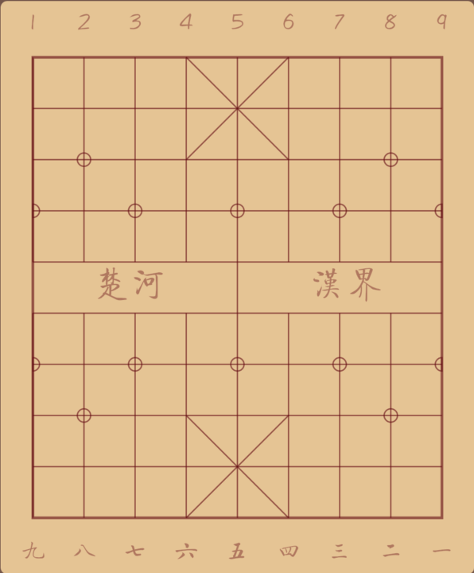
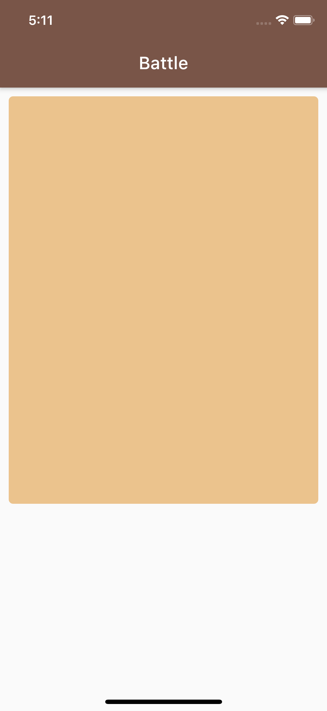
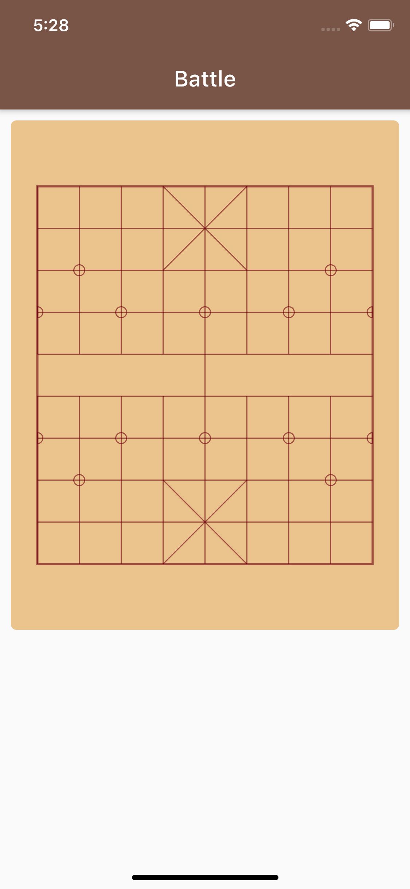
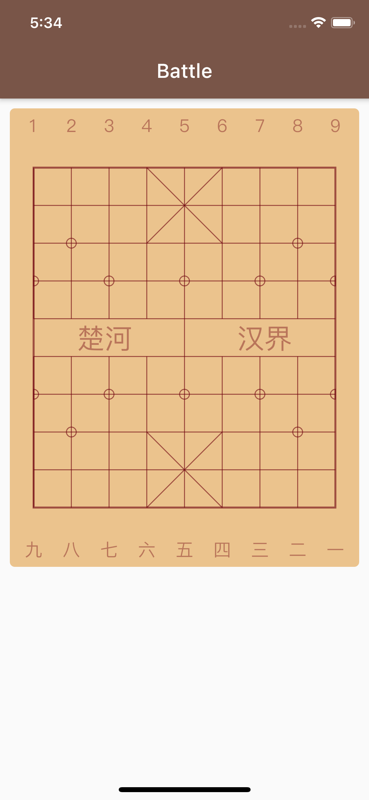

# 5. 先画它一个棋盘

这个节作为这一系列课程真正的开始，我们肯定不是要创建什么 HelloWord 的啦。

象棋游戏在 AppStore 中的主要分类是什么 — Board 类！

这一节开始，我将上一节创建的项目 chessroad 为基础，使用 Canvas 绘制的我们的棋盘 Board。

## 本节目标

我们将要绘制的棋盘是这样的：



棋盘绘制亦然包含许多的细节，我们这一节的绘制工作只包含棋盘，不包含棋子！


## 中国象棋棋盘

在开始棋盘绘制之前，我们要了解一下这个棋盘的一些基本特性，这些特性在我们绘图时将体现到：

* 棋盘由 10 条横线、9 条纵线组成，棋子放在纵横线交叉的点位上
* 棋盘中间有一条「河界」，部分纵线是没有贯通「河界」的
* 棋盘两侧的九宫（将可以移动的范围）从左上角到右下角、以及从右上角到左下角有斜线，作为「仕」移动的引导线。
* 两侧的「炮」和「兵/卒」初始位置中有位置指示
* 棋盘的上下两侧有指示纵线（象棋术语中叫「路数」）的数字。

  ```text
  代表红方的「路数」用中文数字「一」到「九」表示；
  代表黑方的路数用阿拉伯数字「1」到「9」表示；

  对于两方棋手来说，象棋的「路数」是从右边数超的，
  相对于棋手所坐的方向，最右侧一路是第一路、最左侧是第九路。

  这符合中国人传统的文字从右向左书写的习惯
  ```

了解这些信息后，我们开始准备绘图。

## 显示棋盘木板

我们使用 vscode 打开 chessroad 空项目：

```text
~/chessroad $ code .
```

我们在先建立一个 lib/board 文件夹，在其中新建一个 board-widget.dart 文件。在这个文件的中，我们添加一个新的 Widget 的实现类 BoardWidget：

```text
class BoardWidget extends StatelessWidget {
...
}
```

对于棋盘的实现，我们的想法是：

* 用 Container 指定背景色的方式来实现代表棋盘底的「木板」
* 用 CustomPaint 来绘制棋盘上的线、位置坐标
* 棋盘上下边的「路数」指示，以及中间的「河界」文字，由界面布局添加上去

代表棋盘的 BoardWiget 将来会被用在不同的场景，例如「对战」或「阅读棋盘」。此外，考虑到 Android 有多种不同纵横比设备屏幕，我们有必要将 BoardWidget 实现成一个「适用性」强的组件——至少对棋盘的尺寸变化有很强的适应能力：

这里我们需要考虑到 BoardWidget 的宽度 \(width\) 应该是由它的创建者（父组件）指定的。由于棋盘中的格式都是小正方开，棋盘的宽度一确认，其高度也就确定了。

考虑了这些问题之后，我们在 BoardWidget 中开始创建代码棋盘「木板」：

```text
import 'package:flutter/material.dart';
import '../common/color-consts.dart';

class BoardWidget extends StatelessWidget {
  //
  static const Padding = 5.0, DigitsHeight = 36.0;

  final double width, height;

  BoardWidget({@required this.width}) : height = (width - Padding * 2) / 9 * 10 + (Padding + DigitsHeight) * 2;

  Widget build(BuildContext context) {
    return Container(
      width: width,
      height: height,
      decoration: BoxDecoration(
        borderRadius: BorderRadius.circular(5),
        color: ColorConsts.BoardBackground,
      ),
      child: null,
    );
  }
}
```

上边的代码中，我们添加了两个常量：

* Padding 表示了棋盘边界到棋子之间的横向和纵向距离
* DigitsHeight 表示了为棋盘「路数」数字显示预留的高度

> 特别说明：  
> 有时候我们贴出的代码为了简洁，没有添加需要的部分 import 语句，你需要我自行添加。  
> 在 vscode 中，如果一个类型或方法没有被 import 引入，会在其下显示红色波浪线。  
> 当你定位到这一行代码，并按 `Cmd+.`时，vscode 会自动地给出你导入文件建议，选中并回国即完成导入。


我们只有「木板」的棋盘就算是准备好了。为了能从手机上看到这个简陋的棋盘，我们需要搭建一个简单的对战页面：

新建 lib/routes 文件夹，在其下创建 battle-page.dart 文件：

```text
import 'package:flutter/material.dart';
import '../board/board-widget.dart';

class BattlePage extends StatelessWidget {
  //
  static const BoardMarginV = 10.0, BoardMarginH = 10.0;

  @override
  Widget build(BuildContext context) {
    //
    final windowSize = MediaQuery.of(context).size;
    final boardHeight = windowSize.width - BoardMarginH * 2;

    return Scaffold(
      appBar: AppBar(title: Text('Battle')),
      body: Container(
        margin: const EdgeInsets.symmetric(
          horizontal: BoardMarginH,
          vertical: BoardMarginV,
        ),
        child: BoardWidget(width: boardHeight),
      ),
    );
  }
}
```

上边的代码为我们的 BoardWidget 提供了必要的舞台：

* 从 main\(\) 函数中，我们启动了 ChessroadApp，我们这个 App 指定了主体颜色和标题
* 在 ChessroadApp 构造前，我们使用 MediaQuery 查询了窗口的尺寸， 得到了 BoardWidget 的适当宽度
* BoardWidget 被放在外层的另一个 Container 中，这个 Container 定义了左右上下的边边距。不要小看这两个边距值，将来在做屏幕适合的时候，动动这两个值就行了，BoardWidget 都不用一丝丝修改。

打开 flutter create 命令自动创建的 main.dart 文件，删除原有的代码，添加以下的代码：

```text
import 'package:flutter/material.dart';

import 'routes/battle-page.dart';

void main() => runApp(ChessRoadApp());

class ChessRoadApp extends StatelessWidget {
  //
  @override
  Widget build(BuildContext context) {
    //
    return MaterialApp(
      theme: ThemeData(primarySwatch: Colors.brown),
      debugShowCheckedModeBanner: false,
      home: BattlePage(),
    );
  }
}
```

上边的代码中，我们指定了启动 BattlePage 页面，在这之前还为 App 指定了主体颜色。

由于我们修改了默认 App 的名称，所以我们需要在 test/widget\_test.dart 中将「MyApp」修改为「ChessroadApp」，将原来的：

```text
...
await tester.pumpWidget(MyApp());
...
```

修改为：

```text
...
await tester.pumpWidget(ChessRoadApp());
...
```

在 vscode 上按`F5`运行代码，你将看代表我们棋盘的「木板」显示在棋盘上了，这离我们显示棋盘的目标只近一点点。




## 绘制网格

现在，我们开始创建 CustomPaint 组件，在 lib/board 文件夹下，我们新建一个 board-painter.dart 文件，在其中我们实现 BoardPainter 类：

```text
import 'package:flutter/material.dart';

import 'board-widget.dart';

class BoardPainter extends CustomPainter {
  //
  final double width, gridWidth, squareSide;
  final thePaint = Paint();

  BoardPainter({@required this.width})
      : gridWidth = (width - BoardWidget.Padding * 2) * 8 / 9,
        squareSide = (width - BoardWidget.Padding * 2) / 9;

  @override
  void paint(Canvas canvas, Size size) {
    //
  }

  @override
  bool shouldRepaint(CustomPainter oldDelegate) {
    return false;
  }
}
```

在 BoardWidget 中，我们为「木板」设置一个 CustomPaint 的 child，并将 CustomPaint 的 painter 指向 BoardPainter 对象:

```text
...

class BoardWidget extends StatelessWidget {
  //
  ...
  
  Widget build(BuildContext context) {
    //
    return Container(
      width: width,
      height: height,
      decoration: BoxDecoration(
        borderRadius: BorderRadius.circular(5),
        color: ColorConsts.BoardBackground,
      ),
      child: CustomPaint(
        painter: BoardPainter(width: width),
      ),
    );
  }
}
```

到现在为止，我们把 CustomPaint 对象和 BoardPainter 关联起来了，但这个 Painter 什么都没有绘制。

我们开始绘制基本的网格吧：

首先，我们在 BoardPainter 类中添加一个 static 方法 doPaint：

```text
static doPaint(
 Canvas canvas,
 Paint paint,
 double gridWidth,
 double squareSide, {
   double offsetX,
   double offsetY,
}) {
 // ...
}
```

> 之所以使用一个静态方法来包裹所有的绘制动作，是考虑到这个绘制动作可能被重用。将来在分享图时，需要将棋盘绘制在内存画布上时，可以直接在类之外通过静态方法调用这部分逻辑。

然后，我们在 BoardPainter 类的 paint 方法中调用 doPaint 方法：

```text
 @override
 void paint(Canvas canvas, Size size) {
   doPaint(
     canvas,
     thePaint,
     gridWidth,
     squareSide,
     offsetX: BoardWidget.Padding + squareSide / 2,
     offsetY: BoardWidget.Padding + BoardWidget.DigitsHeight + squareSide / 2,
  );
}
```

真正在 doPaint 方法中绘制棋盘，我分需要分几步走：

第一步，我们绘制外框和纵横线：

```text
  static doPaint(
    Canvas canvas,
    Paint paint,
    double gridWidth,
    double squareSide, {
    double offsetX,
    double offsetY,
  }) {
   //
   paint.color = ColorConsts.BoardLine;
   paint.style = PaintingStyle.stroke;
​
   var left = offsetX, top = offsetY;
​
   // 外框
   paint.strokeWidth = 2;
   canvas.drawRect(
     Rect.fromLTWH(left, top, gridWidth, squareSide * 9),
     paint,
  );
​
   // 中轴线
   paint.strokeWidth = 1;
   canvas.drawLine(
     Offset(left + gridWidth / 2, top),
     Offset(left + gridWidth / 2, top + squareSide * 9),
     paint,
  );
​
   // 8 根中间的横线
   for (var i = 1; i < 9; i++) {
     canvas.drawLine(
       Offset(left, top + squareSide * i),
       Offset(left + gridWidth, top + squareSide * i),
       paint,
    );
  }
​
   // 上下各6根短竖线
   for (var i = 0; i < 8; i++) {
     //
     if (i == 4) continue; // 中间拉通的线已经画过了
     
     canvas.drawLine(
       Offset(left + squareSide * i, top),
       Offset(left + squareSide * i, top + squareSide * 4),
       paint,
    );
     canvas.drawLine(
       Offset(left + squareSide * i, top + squareSide * 5),
       Offset(left + squareSide * i, top + squareSide * 9),
       paint,
    );
  }

  ...
}
```

第二步，我们绘制九宫中的四根斜线：

```text
  static doPaint(
    Canvas canvas,
    Paint paint,
    double gridWidth,
    double squareSide, {
    double offsetX,
    double offsetY,
  }) {
  
   ...
   
   // 九宫中的斜线
   canvas.drawLine(
     Offset(left + squareSide * 3, top),
     Offset(left + squareSide * 5, top + squareSide * 2),
     paint,
  );
   canvas.drawLine(
     Offset(left + squareSide * 5, top),
     Offset(left + squareSide * 3, top + squareSide * 2),
     paint,
  );
   canvas.drawLine(
     Offset(left + squareSide * 3, top + squareSide * 7),
     Offset(left + squareSide * 5, top + squareSide * 9),
     paint,
  );
   canvas.drawLine(
     Offset(left + squareSide * 5, top + squareSide * 7),
     Offset(left + squareSide * 3, top + squareSide * 9),
     paint,
  );
  
  ...
}
```

第三步，我们绘制标定炮和兵卒起始位置的标识，我们用小圆圈来做标识，靠边的兵卒位置则用半圆圈来标示：

```text
  static doPaint(
    Canvas canvas,
    Paint paint,
    double gridWidth,
    double squareSide, {
    double offsetX,
    double offsetY,
  }) {
  
   ...
   
   // 炮/兵架位置指示
   final positions = [
     // 炮架位置指示
     Offset(left + squareSide, top + squareSide * 2),
     Offset(left + squareSide * 7, top + squareSide * 2),
     Offset(left + squareSide, top + squareSide * 7),
     Offset(left + squareSide * 7, top + squareSide * 7),
     // 部分兵架位置指示
     Offset(left + squareSide * 2, top + squareSide * 3),
     Offset(left + squareSide * 4, top + squareSide * 3),
     Offset(left + squareSide * 6, top + squareSide * 3),
     Offset(left + squareSide * 2, top + squareSide * 6),
     Offset(left + squareSide * 4, top + squareSide * 6),
     Offset(left + squareSide * 6, top + squareSide * 6),
  ];
​
   positions.forEach((pos) => canvas.drawCircle(pos, 5, paint));
​
   // 兵架靠边位置指示
   final leftPositions = [
     Offset(left, top + squareSide * 3),
     Offset(left, top + squareSide * 6),
  ];
   leftPositions.forEach((pos) {
     var rect = Rect.fromCenter(center: pos, width: 10, height: 10);
     canvas.drawArc(rect, -pi / 2, pi, true, paint);
  });
​
   final rightPositions = [
     Offset(left + squareSide * 8, top + squareSide * 3),
     Offset(left + squareSide * 8, top + squareSide * 6),
  ];
   rightPositions.forEach((pos) {
     var rect = Rect.fromCenter(center: pos, width: 10, height: 10);
     canvas.drawArc(rect, pi / 2, pi, true, paint);
  });
  
  ...
}
```

由于画炮和兵卒位置的时候要画圆圈，我们需要用到 PI 的常量值「pi」，记得要引入dart 的 math 库：

```text
import 'dart:math'
```

好一段艰苦的工作！不过比终于完成了，整个 BoardPainter 的代码是这样的：

```text
import 'dart:math';

import 'package:flutter/material.dart';
import '../common/color-consts.dart';
import 'board-widget.dart';

class BoardPainter extends CustomPainter {
  //
  final double width, gridWidth, squareSide;
  final thePaint = Paint();

  BoardPainter({@required this.width})
      : gridWidth = (width - BoardWidget.Padding * 2) * 8 / 9,
        squareSide = (width - BoardWidget.Padding * 2) / 9;

  @override
  void paint(Canvas canvas, Size size) {
    //
    doPaint(
      canvas,
      thePaint,
      gridWidth,
      squareSide,
      offsetX: BoardWidget.Padding + squareSide / 2,
      offsetY: BoardWidget.Padding + BoardWidget.DigitsHeight + squareSide / 2,
    );
  }

  @override
  bool shouldRepaint(CustomPainter oldDelegate) {
    return false;
  }

  static doPaint(
    Canvas canvas,
    Paint paint,
    double gridWidth,
    double squareSide, {
    double offsetX,
    double offsetY,
  }) {
    //
    paint.color = ColorConsts.BoardLine;
    paint.style = PaintingStyle.stroke;

    var left = offsetX, top = offsetY;

    // 外框
    paint.strokeWidth = 2;
    canvas.drawRect(
      Rect.fromLTWH(left, top, gridWidth, squareSide * 9),
      paint,
    );

    // 中轴线
    paint.strokeWidth = 1;
    canvas.drawLine(
      Offset(left + gridWidth / 2, top),
      Offset(left + gridWidth / 2, top + squareSide * 9),
      paint,
    );

    // 8 根中间的横线
    for (var i = 1; i < 9; i++) {
      canvas.drawLine(
        Offset(left, top + squareSide * i),
        Offset(left + gridWidth, top + squareSide * i),
        paint,
      );
    }

    // 上下各6根短竖线
    for (var i = 0; i < 8; i++) {
      //
      if (i == 4) continue; // 中间拉通的线已经画过了

      canvas.drawLine(
        Offset(left + squareSide * i, top),
        Offset(left + squareSide * i, top + squareSide * 4),
        paint,
      );
      canvas.drawLine(
        Offset(left + squareSide * i, top + squareSide * 5),
        Offset(left + squareSide * i, top + squareSide * 9),
        paint,
      );
    }

    // 九宫中的斜线
    canvas.drawLine(
      Offset(left + squareSide * 3, top),
      Offset(left + squareSide * 5, top + squareSide * 2),
      paint,
    );
    canvas.drawLine(
      Offset(left + squareSide * 5, top),
      Offset(left + squareSide * 3, top + squareSide * 2),
      paint,
    );
    canvas.drawLine(
      Offset(left + squareSide * 3, top + squareSide * 7),
      Offset(left + squareSide * 5, top + squareSide * 9),
      paint,
    );
    canvas.drawLine(
      Offset(left + squareSide * 5, top + squareSide * 7),
      Offset(left + squareSide * 3, top + squareSide * 9),
      paint,
    );

    // 炮/兵架位置指示
    final positions = [
      // 炮架位置指示
      Offset(left + squareSide, top + squareSide * 2),
      Offset(left + squareSide * 7, top + squareSide * 2),
      Offset(left + squareSide, top + squareSide * 7),
      Offset(left + squareSide * 7, top + squareSide * 7),
      // 部分兵架位置指示
      Offset(left + squareSide * 2, top + squareSide * 3),
      Offset(left + squareSide * 4, top + squareSide * 3),
      Offset(left + squareSide * 6, top + squareSide * 3),
      Offset(left + squareSide * 2, top + squareSide * 6),
      Offset(left + squareSide * 4, top + squareSide * 6),
      Offset(left + squareSide * 6, top + squareSide * 6),
    ];

    positions.forEach((pos) => canvas.drawCircle(pos, 5, paint));

    // 兵架靠边位置指示
    final leftPositions = [
      Offset(left, top + squareSide * 3),
      Offset(left, top + squareSide * 6),
    ];
    leftPositions.forEach((pos) {
      var rect = Rect.fromCenter(center: pos, width: 10, height: 10);
      canvas.drawArc(rect, -pi / 2, pi, true, paint);
    });

    final rightPositions = [
      Offset(left + squareSide * 8, top + squareSide * 3),
      Offset(left + squareSide * 8, top + squareSide * 6),
    ];
    rightPositions.forEach((pos) {
      var rect = Rect.fromCenter(center: pos, width: 10, height: 10);
      canvas.drawArc(rect, pi / 2, pi, true, paint);
    });
  }
}

```

成果是显著的，按 vscode 中的`F5`，看看效果吧？



## 棋盘上的路数和河界文字

离这一节的目标，还差一点点了，我们来添加棋盘上的「路数」指示和棋盘中间的「河界」文字吧。

在 lib/board 文件夹下，我们新建一个文件 words-on-board.dart，在其中建立一个名叫 WordsOnBoard 的 StatelessWidget 类：

```text
import 'package:flutter/material.dart';
import 'package:validate/common/color-consts.dart';

class WordsOnBoard extends StatelessWidget {
  //
  static const DigitsFontSize = 18.0;

  @override
  Widget build(BuildContext context) {
    //
    final blackColumns = '１２３４５６７８９', redColumns = '九八七六五四三二一';
    final bChildren = <Widget>[], rChildren = <Widget>[];
    
    final digitsStyle = TextStyle(fontSize: DigitsFontSize);
    final rivierTipsStyle = TextStyle(fontSize: 28.0);

    for (var i = 0; i < 9; i++) {
      //
      bChildren.add(Text(blackColumns[i], style: digitsStyle));
      rChildren.add(Text(redColumns[i], style: digitsStyle));

      if (i < 8) {
        bChildren.add(Expanded(child: SizedBox()));
        rChildren.add(Expanded(child: SizedBox()));
      }
    }

    final riverTips = Row(
      children: <Widget>[
        Expanded(child: SizedBox()),
        Text('楚河', style: rivierTipsStyle),
        Expanded(child: SizedBox(), flex: 2),
        Text('汉界', style: rivierTipsStyle),
        Expanded(child: SizedBox()),
      ],
    );

    return DefaultTextStyle(
      child: Column(
        children: <Widget>[
          Row(children: bChildren),
          Expanded(child: SizedBox()),
          riverTips,
          Expanded(child: SizedBox()),
          Row(children: rChildren),
        ],
      ),
      style: TextStyle(color: ColorConsts.BoardTips),
    );
  }
}
```

在这个 Widget 中，我们将棋盘顶部的黑棋「路数」指示、底部的红棋「路数」指示以及棋盘中间的「楚河」、「汉界」文字添加到一个 Column 布局中，三者之间使用 Expanded 来撑开空白空间。

我们需要将这个布局作为 child 添加到棋盘的 CustomPaint 对象，这样它将显示在棋盘 CustomPaint 之上，在 BoardWidget 中为 CustomPaint 添加 child，如下边这样：

```text
Widget build(BuildContext context) {
   //
   return Container(
     width: width,
     height: height,
     decoration: BoxDecoration(
       borderRadius: BorderRadius.circular(5),
       color: ColorConsts.BoardBackground,
    ),
     child: CustomPaint(
       painter: BoardPainter(width: width),
       child: Container(
         margin: EdgeInsets.symmetric(
           vertical: Padding,
           horizontal: (width - Padding * 2) / 9 / 2 +
           Padding - WordsOnBoard.DigitsFontSize / 2,
        ),
         child: WordsOnBoard(),
      ),
    ),
  );
}
```

到此，我们绘制棋盘的任务就完成了，按 `F5`查看一下我们的成果吧。



最后，我们提交代码到版本库，本节的目标完成了！

```text
chessroad git:(master) $ git add .
chessroad git:(master) $ git commit -m "add color consts"
chessroad git:(master) $ git push
```


