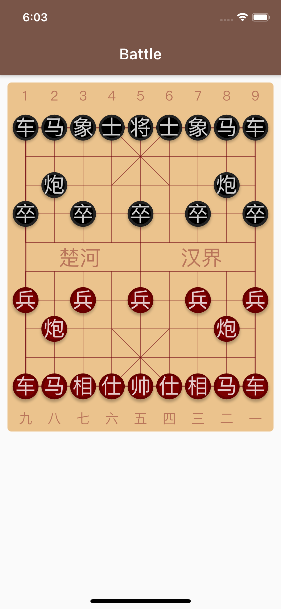
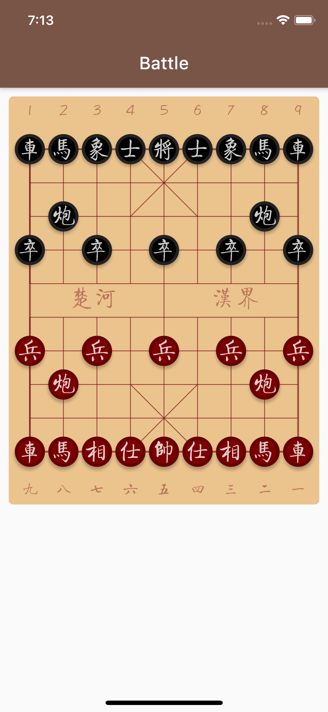

# 6. 棋盘怎能缺少棋子

上一节我们完成的棋盘的布署和绘制，棋子自然是接下来的重要内容了!

CustomPaint 可以将绘制内容分成背景和前景两款部分，上一节中，我们在 CustomPaint 中将 painter 指向了我们的 BoardPainter 对象，它正是用来指定背景 Painter 的。

## 布署棋子组件

CustomPaint 还可以指定一个 foregroundPainter 对象，用于在背景之上绘制前景内容。我们正是要用它来绘制棋盘上的棋子。

在 lib/board 文件夹下，我们新建一个 pieces-painter.dart 文件：

```text
import 'package:flutter/material.dart';
import 'board-widget.dart';

class PiecesPainter extends CustomPainter {
  //
  final double width, gridWidth, squareSide;
  final thePaint = Paint();

  PiecesPainter({@required this.width})
      : gridWidth = (width - BoardWidget.Padding * 2) * 8 / 9,
        squareSide = (width - BoardWidget.Padding * 2) / 9;

  @override
  void paint(Canvas canvas, Size size) {
    //
  }

  @override
  bool shouldRepaint(CustomPainter oldDelegate) {
    //
    return null;
  }
}

```

此外，由于棋盘上的网格宽度、小格式的尺寸等信息，在棋盘的网格和棋子绘制中是统一的，因此我们对之前的代码做一点面向对象重构：在 lib/board 文件夹下新建一个 painter-base.dart 文件，建立一个 BoardPainter 和 PiecesPainter 的共同父类：

```text
import 'package:flutter/material.dart';
import 'board-widget.dart';

abstract class PainterBase extends CustomPainter {
  //
  final double width;

  final thePaint = Paint();
  final gridWidth, squareSide;

  PainterBase({@required this.width})
      : gridWidth = (width - BoardWidget.Padding * 2) * 8 / 9,
        squareSide = (width - BoardWidget.Padding * 2) / 9;
}
```

修改 BoardPainter 类，使其继承自 PainterBase，并且删除掉 已经提升到 父类的 Fields 定义，并修改构造方法的实现方式：

```text
class BoardPainter extends PainterBase {
  //
  BoardPainter({@required double width}) : super(width: width);
  ...
}
```

与此类似，使 PiecesPainter 类也继承自 PainterBase 类：

```text
class PiecesPainter extends PainterBase {
  //
  PiecesPainter({@required double width}) : super(width: width);
  ...
}
```

## 棋盘局面表示

我们暂还不能开始绘制棋子，因为在在绘制棋子的之前，有一个问题我们需要优先考虑：

棋盘上的棋子位置是活动的，我们如何表示当前局面状态？

为了应对这个问题，我们需要建立一组模型，用以表示棋盘上的棋子类型、颜色、位置分布等问题。

我们在 lib 下建立 cchess 文件夹，我们将与中国象棋逻辑的代码限制在此文件夹范围内。

在 cchess 文件夹下，我们建立cc-base.dart 文件，在其中先建立代表棋盘两方的 Side 类和代表棋盘中的棋子的 Piece 类：

> cc 代表 Chinese Chess，以后遇到的 cc 都遵循这个约定。

```text
class Side {
  //
  static const Unknown = '-';
  static const Red = 'w';
  static const Black = 'b';

  static String of(String piece) {
    if ('RNBAKCP'.contains(piece)) return Red;
    if ('rnbakcp'.contains(piece)) return Black;
    return Unknown;
  }

  static bool sameSide(String p1, String p2) {
    return of(p1) == of(p2);
  }

  static String oppo(String side) {
    if (side == Red) return Black;
    if (side == Black) return Red;
    return side;
  }
}

class Piece {
  //
  static const Empty = ' ';
  //
  static const RedRook = 'R';
  static const RedKnight = 'N';
  static const RedBishop = 'B';
  static const RedAdvisor = 'A';
  static const RedKing = 'K';
  static const RedCanon = 'C';
  static const RedPawn = 'P';
  //
  static const BlackRook = 'r';
  static const BlackKnight = 'n';
  static const BlackBishop = 'b';
  static const BlackAdvisor = 'a';
  static const BlackKing = 'k';
  static const BlackCanon = 'c';
  static const BlackPawn = 'p';

  static const Names = {
    Empty: '',
    //
    RedRook: '车',
    RedKnight: '马',
    RedBishop: '相',
    RedAdvisor: '仕',
    RedKing: '帅',
    RedCanon: '炮',
    RedPawn: '兵',
    //
    BlackRook: '车',
    BlackKnight: '马',
    BlackBishop: '象',
    BlackAdvisor: '士',
    BlackKing: '将',
    BlackCanon: '炮',
    BlackPawn: '卒',
  };

  static bool isRed(String c) => 'RNBAKCP'.contains(c);

  static bool isBlack(String c) => 'rnbakcp'.contains(c);
}
```

在 Side 类中，行棋的两方我们各用一个字符表示：'b' 表示黑方，'w' 表示红方，用 '-' 表示未知行棋方。

> 由于中国象棋通用引擎协议—UCCI 中很多规定沿袭了国际象棋的引擎协议，所以使用 'w' 表示红方，这是沿袭了国际象棋对 White 方的表示。


在 Piece 类中，我们各用一个字母来表示棋盘上的棋子。

多数情况下，我们用车、马、相、士、将、炮、兵的英文单词首字母表示对应的棋子。有一个例外，那就是代表「马」的单词 Knight 和代表「将」的单词 King 都是以 'K' 开头，所以约定了用 'N' 或 'n' 来代表「马」。

此外我们，棋软开发者还约定，黑棋用小写字母表示，红棋用对应的大写字母表示。

至此，棋盘上 10 横 9 纵共 90 个交叉点，我们可以用一个数组来表示棋盘上的棋子分布了。

棋子分布情况，加上「当前轮谁走棋」这两个信息，共同构成了一个象棋的「局面」。

我们在 lib/cchess 文件夹下新建一个 phase.dart 文件，表示象棋的局面：

```text
import 'cc-base.dart';

class Phase {
  //
  String _side;
  List<String> _pieces; // 10 行，9 列

  get side => _side;

  trunSide() => _side = Side.oppo(_side);

  String pieceAt(int index) => _pieces[index];
}
```

有了局面信息，我们就可以回到我们的 PiecesPainter 中，进行棋子的绘制动作了。

## 绘制棋子

在基类 PainterBase 中，我们已经计算好了网格的尺寸，这些尺寸是根据 BoardWidget 提供的宽度自动计算出来的。为了让棋子也随着棋盘的大小同步变动，我们约定：

```text
棋子的宽度 = 棋盘一个格子的宽度 * 90%
```

在 PiecesPainter 类中，我们添加表示棋子宽度的字段 pieceSide，此外再添加表示局面的 Phase 实例：

```text
import 'package:flutter/material.dart';
import '../board/painter-base.dart';
import '../cchess/phase.dart';

class PiecesPainter extends PainterBase {
  //
  final Phase phase;
  double pieceSide;

  PiecesPainter({@required double width, @required this.phase}) : super(width: width) {
    pieceSide = squareSide * 0.9;
  }

  @override
  void paint(Canvas canvas, Size size) {
    //
  }

  @override
  bool shouldRepaint(CustomPainter oldDelegate) {
    //
    return false;
  }
}
```

现在绘制棋子需要的一切数据就绪，我们开始绘制工作吧。我们在 PiecesPainter 类中添加静态方法 doPaint：

```text
 static doPaint(
   Canvas canvas,
   Paint paint, {
   Phase phase,
   double gridWidth,
   double squareSide,
   double pieceSide,
   double offsetX,
   double offsetY,
}) {
   //
}
```

> 之所以使用一个静态方法来包裹所有的绘制动作，是考虑到这个绘制动作可能被重用。将来在分享图，需要将棋盘绘制在内存画布上时，可以直接在类之外通过静态方法调用这部分逻辑。


然后我们在 PiecesPainter 类的 paint 方法中调用 doPaint 方法：

```text
 @override
 void paint(Canvas canvas, Size size) {
   //
   doPaint(
     canvas,
     thePaint,
     phase: phase,
     gridWidth: gridWidth,
     squareSide: squareSide,
     pieceSide: pieceSide,
     offsetX: BoardWidget.Padding + squareSide / 2,
     offsetY: BoardWidget.Padding + BoardWidget.DigitsHeight + squareSide / 2,
  );
}
```

绘制一个棋子的工作大致有以下几个步骤：

* 绘制棋子棋子大小相同的圆形阴影
* 区分棋子的颜色填充指定大小的圆
* 区分棋子的颜色在代表棋子的圆外添加一个圈圈边框
* 在棋盘的圆圈中间，区分颜色写上代表棋子的文字

有了代表棋子分布的数组，我们的绘制工作其就是对棋盘上存在于指定位置的棋子，分别执行一轮棋子绘制动作。

为了让绘制动作逻辑更清晰，我们将绘制动作分解成两步：

* 第一步我们确定各个棋子以及其所应出现的位置，并把它们添加到一个列表中
* 第二步我们对已标定位置的每一个棋子棋子执行绘图动作

开始前还有一点准备工作：我们在 PiecesPainter 之上添加一个绘制专用的 Stub 类：

```text
class PiecePaintStub {
  final String piece;
  final Offset pos;
  PiecePaintStub({this.piece, this.pos});
}
```

然后我们执行绘制动作的第一步：

```text
static doPaint(
    Canvas canvas,
    Paint paint, {
    Phase phase,
    double gridWidth,
    double squareSide,
    double pieceSide,
    double offsetX,
    double offsetY,
  }) {
    //
    final left = offsetX, top = offsetY;

    final shadowPath = Path();
    final piecesToDraw = <PiecePaintStub>[];

    for (var row = 0; row < 10; row++) {
      //
      for (var column = 0; column < 9; column++) {
        //
        final piece = phase.pieceAt(row * 9 + column);
        if (piece == Piece.Empty) continue;

        var pos = Offset(left + squareSide * column, top + squareSide * row);

        piecesToDraw.add(PiecePaintStub(piece: piece, pos: pos));

        shadowPath.addOval(
          Rect.fromCenter(center: pos, width: pieceSide, height: pieceSide),
        );
      }
    }

    canvas.drawShadow(shadowPath, Colors.black, 2, true);
    
    ...
  }
```

这一步部，我们将每个棋子的位置计算好，并添加到一个叫 piecesToDraw 的列表中了。顺便地，还把所有棋子的位置的阴影路径添加了一个 Path 之中，并进行了一次性的棋子阴影绘制。

现在我们执行绘制动作的第二步——棋子绘制：

```text
static doPaint(
    Canvas canvas,
    Paint paint, {
    Phase phase,
    double gridWidth,
    double squareSide,
    double pieceSide,
    double offsetX,
    double offsetY,
  }) {
    //
    ...

    paint.style = PaintingStyle.fill;

    final textStyle = TextStyle(
      color: ColorConsts.PieceTextColor,
      fontSize: pieceSide * 0.8,
      height: 1.0,
    );

    piecesToDraw.forEach((pps) {
      //
      paint.color = Piece.isRed(pps.piece) ? ColorConsts.RedPieceBorderColor : ColorConsts.BlackPieceBorderColor;

      canvas.drawCircle(pps.pos, pieceSide / 2, paint);

      paint.color = Piece.isRed(pps.piece) ? ColorConsts.RedPieceColor : ColorConsts.BlackPieceColor;

      canvas.drawCircle(pps.pos, pieceSide * 0.8 / 2, paint);

      final textSpan = TextSpan(text: Piece.Names[pps.piece], style: textStyle);
      final textPainter = TextPainter(
        text: textSpan,
        textDirection: TextDirection.ltr,
      )..layout();

      final metric = textPainter.computeLineMetrics()[0];
      final textSize = textPainter.size;

      // 从顶上算，文字的 Baseline 在 2/3 高度线上
      final textOffset = pps.pos - Offset(textSize.width / 2, metric.baseline - textSize.height / 3);

      textPainter.paint(canvas, textOffset);
    });
  }
```

对于上一步标定好位置并添加到 piecesToDraw 列表的每一个棋子，这里进行了循环绘制工作，步骤和前文所述一致。

棋子绘绘制部分的工作就绪了，现在我们对 BoardWidget 进行必要的调整，以呈现一个初始棋盘的样子。

## 棋盘初始局面

这里有一个问题需要思考：棋盘局面的初始状态从何而来？

这是我们将来要面对的问题，目前我们用一个预置的棋盘数组来暂回避一下这个问题。我们在 Phase 类中添加一个命名为 defaultPhase 构造方法，在这个构造方法，我们手工布局一个初始的象棋开局棋子局面：

```text
...

class Phase {
  //
  ...

  Phase.defaultPhase() {
    //
    _side = Side.Red;
    _pieces = List<String>(90);

    _pieces[0 * 9 + 0] = Piece.BlackRook;
    _pieces[0 * 9 + 1] = Piece.BlackKnight;
    _pieces[0 * 9 + 2] = Piece.BlackBishop;
    _pieces[0 * 9 + 3] = Piece.BlackAdvisor;
    _pieces[0 * 9 + 4] = Piece.BlackKing;
    _pieces[0 * 9 + 5] = Piece.BlackAdvisor;
    _pieces[0 * 9 + 6] = Piece.BlackBishop;
    _pieces[0 * 9 + 7] = Piece.BlackKnight;
    _pieces[0 * 9 + 8] = Piece.BlackRook;

    _pieces[2 * 9 + 1] = Piece.BlackCanon;
    _pieces[2 * 9 + 7] = Piece.BlackCanon;

    _pieces[3 * 9 + 0] = Piece.BlackPawn;
    _pieces[3 * 9 + 2] = Piece.BlackPawn;
    _pieces[3 * 9 + 4] = Piece.BlackPawn;
    _pieces[3 * 9 + 6] = Piece.BlackPawn;
    _pieces[3 * 9 + 8] = Piece.BlackPawn;

    _pieces[9 * 9 + 0] = Piece.RedRook;
    _pieces[9 * 9 + 1] = Piece.RedKnight;
    _pieces[9 * 9 + 2] = Piece.RedBishop;
    _pieces[9 * 9 + 3] = Piece.RedAdvisor;
    _pieces[9 * 9 + 4] = Piece.RedKing;
    _pieces[9 * 9 + 5] = Piece.RedAdvisor;
    _pieces[9 * 9 + 6] = Piece.RedBishop;
    _pieces[9 * 9 + 7] = Piece.RedKnight;
    _pieces[9 * 9 + 8] = Piece.RedRook;

    _pieces[7 * 9 + 1] = Piece.RedCanon;
    _pieces[7 * 9 + 7] = Piece.RedCanon;

    _pieces[6 * 9 + 0] = Piece.RedPawn;
    _pieces[6 * 9 + 2] = Piece.RedPawn;
    _pieces[6 * 9 + 4] = Piece.RedPawn;
    _pieces[6 * 9 + 6] = Piece.RedPawn;
    _pieces[6 * 9 + 8] = Piece.RedPawn;

    for (var i = 0; i < 90; i++) {
      _pieces[i] ??= Piece.Empty;
    }
  }

  ...
}
```

然后，在 BoardWidget 中，我们将 CustomPaint 的 foregroundPainter 指为我们的 PiecesPainter 类的实例。在 PiecesPainter 类的创建过程，我直接创建一个 Phase 类的实例：

```text
import 'package:flutter/material.dart';
import '../cchess/phase.dart';
import '../common/color-consts.dart';
import 'board-painter.dart';
import 'pieces-painter.dart';
import 'words-on-board.dart';

class BoardWidget extends StatelessWidget {
  //
  static const Padding = 5.0, DigitsHeight = 36.0;

  final double width, height;
  BoardWidget({@required this.width}) :
    height = (width - Padding * 2) / 9 * 10 + (Padding + DigitsHeight) * 2;

  Widget build(BuildContext context) {
    //
    return Container(
      width: width,
      height: height,
      decoration: BoxDecoration(
        borderRadius: BorderRadius.circular(5),
        color: ColorConsts.BoardBackground,
      ),
      child: CustomPaint(
        painter: BoardPainter(width: width),
        foregroundPainter: PiecesPainter(
          width: width,
          phase: Phase.defaultPhase(),
        ),
        child: Container(
          margin: EdgeInsets.symmetric(
            vertical: Padding,
            horizontal: (width - Padding * 2) / 9 / 2 + 
              Padding - WordsOnBoard.DigitsFontSize / 2,
          ),
          child: WordsOnBoard(),
        ),
      ),
    );
  }
}
```

到这里，我们检查一下开发成果，在 vscode 中按`F5`键运行产品看看效果：



## 使用中国风字体

到目前为止，其它都还好，只是有一样：

现在我们在图片看到的文字都是系统默认的字体，没有一点「中国风」。我们需要将找一个适合象棋棋子显示的美观字体，然后用它来绘制棋子和棋盘上的「路数」、「河界」提示文字。

这件事件做起来不难：但首先我们需要找到自己喜欢的字体，并将其添加到我们的项目中。

> 出于演示目的，我直接在网络上下载了「方正启体」，请大家支持正版，保持知识产权！

我们在项目根目录下，新建一个 fonts 文件夹，并将你的字体文件复制到此文件夹下。然后在项目根目录下的 pubspec.yaml 文件中添加你的自定义字体：

```text
name: chessroad
description: A new Flutter project.
​
version: 1.0.0+1
​
environment:
sdk: ">=2.1.0 <3.0.0"
​
dependencies:
flutter:
  sdk: flutter
​
cupertino_icons: ^0.1.2
​
dev_dependencies:
flutter_test:
  sdk: flutter
​
flutter:
​
uses-material-design: true
​
 # assets:
 # - images/a_dot_burr.jpeg
 # - images/a_dot_ham.jpeg
​
fonts:
  - family: QiTi
    fonts:
      - asset: fonts/qiti.ttf
​
```

添加 yaml 配置后，即可使用自定义的字体。

> 记住：只有被注册到 pubspec.yaml 中的资源，进行应用打包时才会自动地包含在应用包内。


我们在 PiecesPainter 类的 doPaint 方法中找到棋子上的文字的样式定义，修改前是这样的：

```text
...
final textStyle = TextStyle(
  color: ColorConsts.PieceTextColor,
  fontSize: pieceSide * 0.8,
  height: 1.0,
);
...
```

添加 fontFamily 之后，修改为：

```text
...
final textStyle = TextStyle(
  color: ColorConsts.PieceTextColor,
  fontSize: pieceSide * 0.8,
  fontFamily: 'QiTi',
  height: 1.0,
);
...
```

棋子的字体修改完之后，别忘了棋盘上的「路数」数字和「河界」提示文字的字体。在 WordsOnBoard 类的实现代码中，我们找到以下这一段：

```text
   return DefaultTextStyle(
     child: Column(
       children: <Widget>[
         Row(children: bChildren),
         Expanded(child: SizedBox()),
         riverTips,
         Expanded(child: SizedBox()),
         Row(children: rChildren),
      ],
    ),
     style: TextStyle(color: ColorConsts.BoardTips),
  );
```

在默认文字模式中，添加对 fontMamily 的指定，修改后的样子：

```text
   return DefaultTextStyle(
     child: Column(
       children: <Widget>[
         Row(children: bChildren),
         Expanded(child: SizedBox()),
         riverTips,
         Expanded(child: SizedBox()),
         Row(children: rChildren),
      ],
    ),
     style: TextStyle(color: ColorConsts.BoardTips, fontFamily: 'QiTi'),
  );
```

添加字体后，需要重新运行一下产品。现在看看是不是美观多了？



将代码提交到 git，然后休息一下，我们将才干了一个大活，需要给自己一点犒赏！

