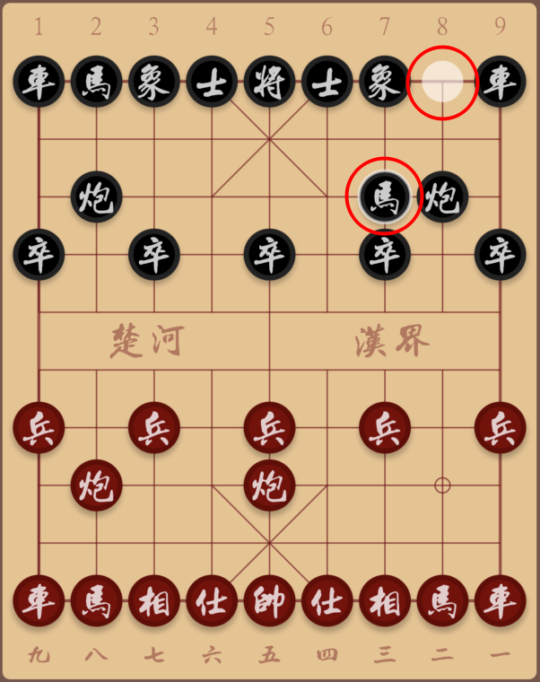

# 7. 让棋盘支持行棋动作

上一节，我们的棋盘棋子都非常漂亮地呈现在屏幕上了，但还不支持走棋动作。

这一节，我们要记让棋子可以支持行棋动作，得依赖于手势检测。

## 检测棋盘点击

在 Flutter 中，要检测用户的点击、长按、拖拽等操作是很简单的事情，只需要用 GestureDetector 包裹你想查检测手势的 Widget 即可。我们修改一下 BoardWidget 的 build 方法，用 GestureDetector 包裹我们的棋盘，将它修改成下边这样：

```text
 @override
 Widget build(BuildContext context) {
   //
   final boardContainer = Container(
     width: width,
     height: height,
     decoration: BoxDecoration(
       borderRadius: BorderRadius.circular(5),
       color: ColorConsts.BoardBackground,
    ),
     child: CustomPaint(
       painter: BoardPainter(width: width),
       foregroundPainter: PiecesPainter(width: width, phase: Phase.defaultPhase()),
       child: Container(
         margin: EdgeInsets.symmetric(
           vertical: Padding,
           horizontal: (width - Padding * 2) / 9 / 2 +
           Padding - WordsOnBoard.DigitsFontSize / 2,
        ),
         child: WordsOnBoard(),
      ),
    ),
  );
​
   return GestureDetector(child: boardContainer, onTapUp: (d) {
     print(d.localPosition);
  });
}
```

上边的代码中，我们仅仅是把原来的构造 widget 的代码赋值给了 boardContainer 变量，然后用 GestureDetector 包裹了代表 Widget 的变量 boardContainer。

Board 的点击事件，我们关心的不是哪个坐标点被用户点击了，关心的应该是棋盘上的哪位交叉点被用户点击了。这些知识是 BoardWiget 的内部知识，因此我们在 GestureDetector 的 onTapUp 回调中，将坐标点解释成相应的棋盘上的交叉位置。具体动作为将 GestureDetector 的 onTapUp 回调方法的内容由：

```text
@override
Widget build(BuildContext context) {

  ...
  
  return GestureDetector(child: boardContainer, onTapUp: (d) {
    print(d.localPosition);
  });
}
```

修改为：

```text
@override
Widget build(BuildContext context) {

  ...

  return GestureDetector(
    child: boardContainer,
    onTapUp: (d) {
      //
      final gridWidth = (width - Padding * 2) * 8 / 9;
      final squareSide = gridWidth / 8;
  
      final dx = d.localPosition.dx, dy = d.localPosition.dy;
      final row = (dy - Padding - DigitsHeight) ~/ squareSide;
      final column = (dx - Padding) ~/ squareSide;
  
      if (row < 0 || row > 9) return;
      if (column < 0 || column > 8) return;
  
      print('row: $row, column: $column');
    },
  );
}
```

## 接管棋盘上的点击事件

现在需要考虑的一个问题：Board 上的点击事件由谁来接管呢？

Board 上的用户行棋点击事件，应该是 Board 创建者关心的事情。因此，点击事件的回调应该由外部传入。我们为 BoardWidget 添加一个回调，并修改 BoardWiget 的构造函数。

具体动作为将 BoardWidget 头部找到以下部分代码：

```text
class BoardWidget extends StatelessWidget {
  
  ...

  final double width, height;
  BoardWidget({@required this.width}) : 
    height = (width - Padding * 2) / 9 * 10 + (Padding + DigitsHeight) * 2;

  ...
}
```

将它修改为：

```text
class BoardWidget extends StatelessWidget {
  //
  ...

  final double width, height;
  final Function(BuildContext, int) onBoardTap;

  BoardWidget({@required this.width, @required this.onBoardTap})
      : height = (width - Padding * 2) / 9 * 10 + (Padding + DigitsHeight) * 2;

  ...
}
```

然后，我们在 GestureDetector 的 onTapUp 回调中，将用户点击棋盘交叉点位的事件，回调 onBoardTap 方法。修改后 BoardWidget 的 build 方法代码如下：

```text
@override
  Widget build(BuildContext context) {

    ...

    return GestureDetector(
      child: boardContainer,
      onTapUp: (d) {
        //
        final gridWidth = (width - Padding * 2) * 8 / 9;
        final squareSide = gridWidth / 8;

        final dx = d.localPosition.dx, dy = d.localPosition.dy;
        final row = (dy - Padding - DigitsHeight) ~/ squareSide;
        final column = (dx - Padding) ~/ squareSide;

        if (row < 0 || row > 9) return;
        if (column < 0 || column > 8) return;

        onBoardTap(context, row * 9 + column);
      },
    );
  }
```

代码中的「row \* 9 + column」是棋盘位置表示的一个基本约定。它表示的意思是：

第 `row` 行第 `column` 列的棋子，在棋盘局面 Phase 类的棋子列表 `List<String>(90)` 中的存放索引值是 `row * 9 + column`。

关于棋盘上的行列和 Phase 中的棋子列表索引的转换关系是比较重要的，这种转换在后边的代码中还会多次出现，请大家注点意！

## 处理行棋逻辑

为了反映棋盘变动状态，首先我们将 BattlePage 由 StatelessWidget 的修改为 StatefulWidget。

> 要在 vscode 中将一个 StatelessWidget 修改为 StatefulWidget，可以先将光标移动到 BattlePage 类声明语句上，然后按「Cmd+.」，在弹出的菜单中点 「Convert to StatefulWidget」 菜单项。

之前我们为的 BoardWidget 的构造方法添加了onBoardTap 的回调参数。现在 BattlePage 的 State 类 \_BattlePageState 中，我们添加一个 onBoardTap 方法，并在 BoardWidget 的构造方法中，将它传递给 BoardWidget，这样 BoardWidget 的点击事件就会被传递给 BattlePage 的 onBoardTap 方法了。完成这一步后，battle-page.dart 文件这个样子的：

```text
import 'package:flutter/material.dart';
import '../board/board-widget.dart';

class BattlePage extends StatefulWidget {
  //
  static const BoardMarginV = 10.0, BoardMarginH = 10.0;

  @override
  _BattlePageState createState() => _BattlePageState();
}

class _BattlePageState extends State<BattlePage> {
  //
  onBoardTap(BuildContext context, int pos) {
    //
    print('board cross index: $pos');
  }

  @override
  Widget build(BuildContext context) {
    //
    final windowSize = MediaQuery.of(context).size;
    final boardHeight = windowSize.width - BattlePage.BoardMarginH * 2;

    return Scaffold(
      appBar: AppBar(title: Text('Battle')),
      body: Container(
        margin: const EdgeInsets.symmetric(
          horizontal: BattlePage.BoardMarginH,
          vertical: BattlePage.BoardMarginV,
        ),
        child: BoardWidget(width: boardHeight, onBoardTap: onBoardTap),
      ),
    );
  }
}
```

回顾一下前边的棋盘绘制逻辑，我们会发现，棋盘上的棋子分布情况是由 Phase 类持有的。

用户点击棋盘行棋，如果想要将行棋动作反映到棋子分布位置的调整上，肯定是要修改 Phase 类的棋子存放列表 `List<String> _pieces;` 对象的。

之前了为棋盘展示，我们只是在 PiecesPainter 类的构建环节，直接用 Phase.defaultPhase\(\) 构造了一个象棋的初始局面。

但我们回到一个游戏整体的宏观面上，我们要考虑一下 Phase 对象应该被谁来持有呢？到目标为止，BoardWidget 的持有者 BattlePage 是一个「直觉」的选择。

如果我们我们由 BattlePage 持有 Phase 对象，那使用过程是什么样子的呢？

* 第一步，我们在 BattlePage 里创建 Phase 实例
* 第二步，我们将 Phase 实例传递给 BoardWidget
* 第三步，BoardWidget 将 Phase 实例传递给 PiecesPainter

这样做能通，但感觉 Phase 传递的路径有点长，并且这个传递链接上的 BoardWidget 其实是没有必要知道 Phase 是什么东西的。

应对这个问题，我们可以新建一个 Battle 类，并将其做成一个全局可以访问的对象。我们新建 lib/game 文件夹，在其中创建一个 battle.dart 文件：

```text
import '../cchess/phase.dart';

class Battle {
  //
  static Battle _instance;

  static get shared {
    _instance ??= Battle();
    return _instance;
  }

  Phase _phase;

  init() {
    _phase = Phase.defaultPhase();
  }

  get phase => _phase;
}
```

接下来，我们在 \_BattlePageState 中覆盖 initState 方法，在其中对 Battle 进行初始化：

```text
...

class _BattlePageState extends State<BattlePage> {
  //
  @override
  void initState() {
    super.initState();
    Battle.shared.init();
  }

  ...
}

```

然后，我们在 BoadWidget 中修改CustomPainter 的创建部分代码，将其修改为：

```text
...

class BoardWidget extends StatelessWidget {

  ...
  
  @override
  Widget build(BuildContext context) {
    //
    final boardContainer = Container(
      ...
      child: CustomPaint(
        painter: BoardPainter(width: width),
        foregroundPainter: PiecesPainter(
          width: width,
          phase: Battle.shared.phase,
        ),
        child: Container(
          margin: EdgeInsets.symmetric(
            vertical: Padding,
            horizontal: (width - Padding * 2) / 9 / 2 +
            	Padding - WordsOnBoard.DigitsFontSize / 2,
          ),
          child: WordsOnBoard(),
        ),
      ),
    );

    ...
  }
}
```

现在好了，BoardWidget 不用知道 Phase 的细节了，它管理好自己的棋盘绘制、坐标翻译和点击事件上报就完事了。

是时候继续我们的棋盘事件处理了。在这儿，我们有个象棋软件的常识要向大家介绍一下：

* 当我们点击自己一方的某个棋子时，被点中的棋子会有被「选中」的效果
* 我们选中棋子后再点击目的地移动棋子后，移动前、后的位置都有指示效果



为此，我们为 Battle 类添加两成员变量 \_focusIndex 和 \_blurIndex，用于标记当前位置和前一个位置，在 init 方法中对它们进行初始化，并为其添加修改和访问方法，修改后的 Phase 类代码如下：

```text
import '../cchess/phase.dart';

class Battle {
  //
  static Battle _instance;

  Phase _phase;
  int _focusIndex, _blurIndex;

  static get shared {
    _instance ??= Battle();
    return _instance;
  }

  init() {
    _phase = Phase.defaultPhase();
    _focusIndex = _blurIndex = -1;
  }

  select(int pos) {
    _focusIndex = pos;
    _blurIndex = -1;
  }

  move(int from, int to) {
    // TODO: change phase's pieces list
    _blurIndex = from;
    _focusIndex = to;
  }

  clear() {
    _blurIndex = _focusIndex = -1;
  }

  get phase => _phase;

  get focusIndex => _focusIndex;

  get blurIndex => _blurIndex;
}
```

这里 Battle 类中可以访问或修改位置标记的值，但 move 方法中并未真正修改 Phase 的棋子列表。我们先将棋子的选择与移动标记的绘制工作处理一下。

 在 PiecesPainter 类中，我们添加两个成员变量 focusIndex 和 blurIndex，并修改构造方法，要求 PiecesPainter 的持有者传入这两个参数：

```text
class PiecesPainter extends PainterBase {
  //
  final Phase phase;
  final int focusIndex, blurIndex;
​
  double pieceSide;
​
  PiecesPainter({
   @required double width,
   @required this.phase,
   this.focusIndex = -1,
   this.blurIndex = -1,
  }) : super(width: width) {
    //
    pieceSide = squareSide * 0.9;
  }
 
  ...
}
```

再回到 BoardWidget 的 CustomPaint 构造处，我们将 focusIndex 和 blurIndex 作为构造参数传递给 PiecesPainter 类：

```text
...

class BoardWidget extends StatelessWidget {

  ...
  
  @override
  Widget build(BuildContext context) {
    //
    final boardContainer = Container(
      ...
      child: CustomPaint(
        painter: BoardPainter(width: width),
        foregroundPainter: PiecesPainter(
          width: width,
          phase: Battle.shared.phase,
          focusIndex: Battle.shared.focusIndex,
          blurIndex: Battle.shared.blurIndex,
        ),
        child: Container(
          margin: EdgeInsets.symmetric(
            vertical: Padding,
            horizontal: (width - Padding * 2) / 9 / 2 +
            	Padding - WordsOnBoard.DigitsFontSize / 2,
          ),
          child: WordsOnBoard(),
        ),
      ),
    );

    ...
  }
}
```

然后，对 PiecesPainter 的 doPaint 方法，我们添加两个参数：

```text
static doPaint(
   Canvas canvas,
   Paint paint, {
   Phase phase,
   double gridWidth,
   double squareSide,
   double pieceSide,
   double offsetX,
   double offsetY,
   int focusIndex = -1,
   int blurIndex = 1,
}) {
...
}
```

对应的，我们在 PiecesPainter 的 paint 方法中修改对 doPaint 方法的调用代码：

```text
 @override
 void paint(Canvas canvas, Size size) {
   //
   doPaint(
     canvas,
     thePaint,
     phase: phase,
     gridWidth: gridWidth,
     squareSide: squareSide,
     pieceSide: pieceSide,
     offsetX: BoardWidget.Padding + squareSide / 2,
     offsetY: BoardWidget.Padding + BoardWidget.DigitsHeight + squareSide / 2,
     focusIndex: focusIndex,
     blurIndex: blurIndex,
  );
}
```

接下来的事情，当然就是在 doPaint 方法中添加位置指示的绘制代码。

在 PiecesPainter 的 doPaint 方法尾部添加对选择和移动位置指示的绘制代码：

```text
class PiecesPainter extends PainterBase {

  ...

  static doPaint(
    Canvas canvas,
    Paint paint, {
    Phase phase,
    double gridWidth,
    double squareSide,
    double pieceSide,
    double offsetX,
    double offsetY,
    int focusIndex = -1,
    int blurIndex = 1,
  }) {

    ...

    // draw focus and blur position

    if (focusIndex != -1) {
      //
      final int row = focusIndex ~/ 9, column = focusIndex % 9;

      paint.color = ColorConsts.FocusPosition;
      paint.style = PaintingStyle.stroke;
      paint.strokeWidth = 2;

      canvas.drawCircle(
        Offset(left + column * squareSide, top + row * squareSide),
        pieceSide / 2,
        paint,
      );
    }

    if (blurIndex != -1) {
      //
      final row = blurIndex ~/ 9, column = blurIndex % 9;

      paint.color = ColorConsts.BlurPosition;
      paint.style = PaintingStyle.fill;

      canvas.drawCircle(
        Offset(left + column * squareSide, top + row * squareSide),
        pieceSide / 2 * 0.8,
        paint,
      );
    }
  }
}
```

现在比较接近最本质的内容了 — 修改棋盘上的棋子位置。让我们回到 \_BattlePageState 类的 onBoardTap 方法，我们添加棋子选中、移动的基本逻辑：

```text
class _BattlePageState extends State<BattlePage> {

  ...

  onBoardTap(BuildContext context, int index) {
    //
    final phase = Battle.shared.phase;

    // 仅 Phase 中的 side 指示一方能动棋
    if (phase.side != Side.Red) return;

    final tapedPiece = phase.pieceAt(index);

    // 之前已经有棋子被选中了
    if (Battle.shared.focusIndex != -1 && Side.of(phase.pieceAt(Battle.shared.focusIndex)) == Side.Red) {
      //
      // 当前点击的棋子和之前已经选择的是同一个位置
      if (Battle.shared.focusIndex == index) return;

      // 之前已经选择的棋子和现在点击的棋子是同一边的，说明是选择另外一个棋子
      final focusPiece = phase.pieceAt(Battle.shared.focusIndex);

      if (Side.sameSide(focusPiece, tapedPiece)) {
        Battle.shared.select(index);
        return;
      }

      // 现在点击的棋子和上一次选择棋子不同边，要么是吃子，要么是移动棋子到空白处
      if (Battle.shared.move(Battle.shared.focusIndex, index)) {
        // todo: scan game result
      }
      //
    } else {
      // 之前未选择棋子，现在点击就是选择棋子
      if (tapedPiece != Piece.Empty) Battle.shared.select(index);
    }
  }

  ...
}
```

onBoardTap 方法中存在一些细腻的逻辑，却并不是复杂的东西，大家可以看下代码上的注释文字。

看上边的代码，我们知道最核心的动作 — 棋子的移动动作是在 Battle 类的 move 方法中进行的。

棋子列表是由 Phase 类持有的，为了逻辑低耦合，我们在 Phase 类中执行真正的棋子移动操作，因此我们先在 Phase 类中添加 move 方法的实现：

```text
...

class Phase {

  ...

  bool move(int from, int to) {
    //
    if (!validateMove(from, to)) return false;

    // 修改棋盘
    _pieces[to] = _pieces[from];
    _pieces[from] = Piece.Empty;

    // 交换走棋方
    _side = Side.oppo(_side);

    return true;
  }

  /// 验证移动棋子的着法是否合法
  bool validateMove(int from, int to) {
    // TODO:
    return true;
  }

  ...
}

```

接下来的事情就简单了，我们在 Battle 类的 move 方法调用 Phase 的 move 方法，将其修改为下边的样子：

```text
...

class Battle {

  ...

  bool move(int from, int to) {
    //
    if (!_phase.move(from, to)) return false;

    _blurIndex = from;
    _focusIndex = to;

    return true;
  }

  ...
}

```

数据层面的棋子移动逻辑都完成了。最后一步让界面体验数据状态改动。我们在 \_BattlePageState 的 onBoardTap 方法尾部添加一行代码：

```text
setState(() {});
```

现在又到了检验成果的时间了，在 vscode 中按 `F5`，试试在棋盘上点击棋子走棋看看？

> 目前，还只能由红方走一步棋，这是因为：
>
> * 目前限制了玩家只能动红色的棋，默认情况下一开局就轮到红方走棋了
> * 红方走一步棋后，就切换到黑方走棋了，所以红色再不能云棋了


提交代码到 git 仓库吧！

