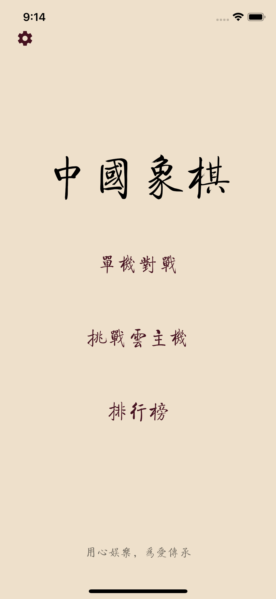
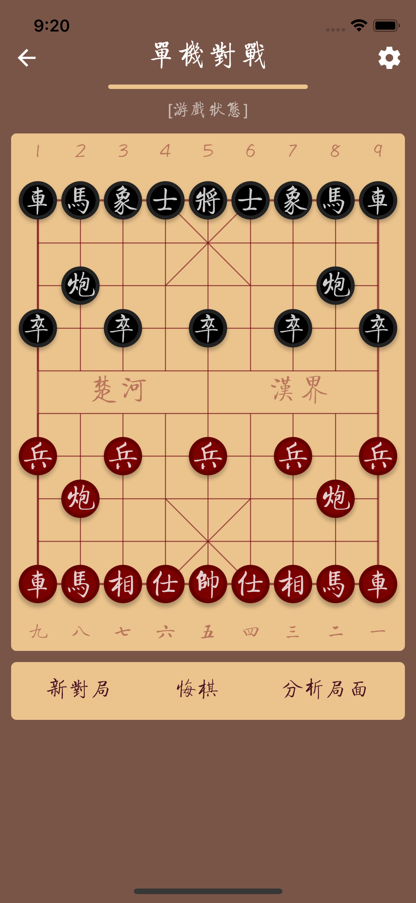
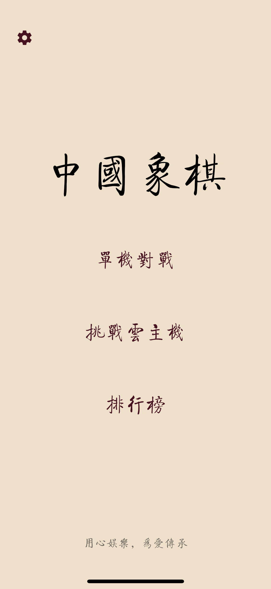
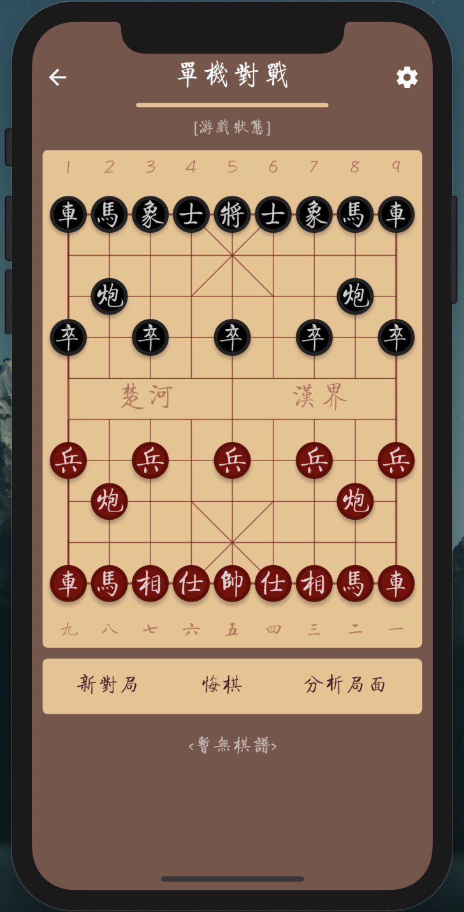
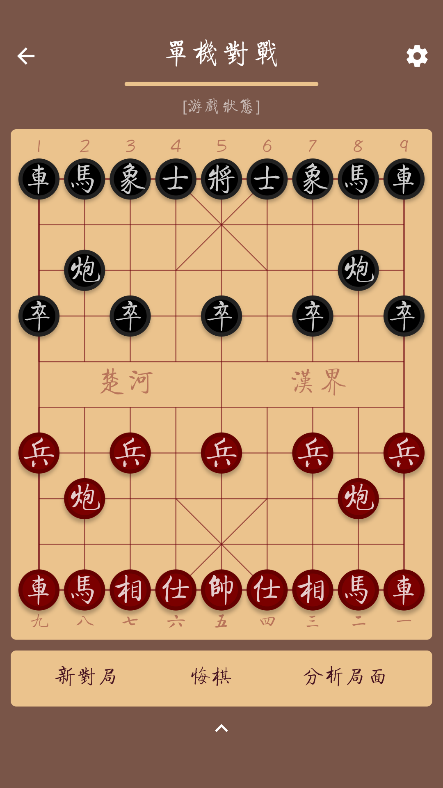
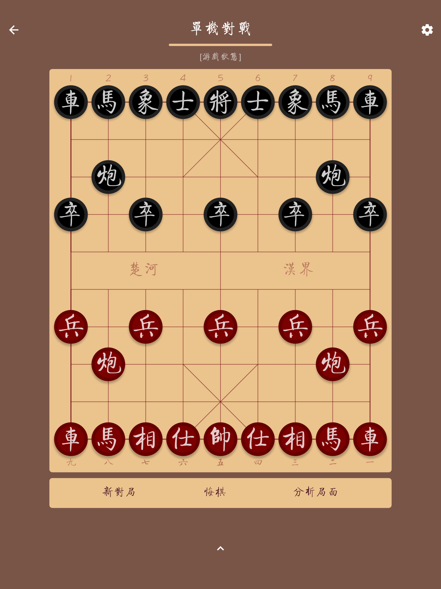

# 8. 实现游戏的 UI 骨架

到目前为此，我们的棋路游戏已经有些眉目了。在做了一大堆复杂工作后，现在是做点轻松且有成效的工作的时间了。让我们来给游戏添加基本的界面元素了。

我们将在游戏中使用全屏界面，考虑到目前手机中有大量的刘海屏，所以我们再 ChessroadApp 中定义一个状态栏高度的命名常量，游戏的每个页面在 StatusBar 的调试范围内不要放置内容：

```text
class ChessRoadApp extends StatelessWidget {
  //
  static const StatusBarHeight = 28.0;
  ...
}
```

现在，我们为游戏添加一个开始菜单页面：在 lib/routes 文件夹下，我们创建一个新的文件 main-menu.dart，在其中创建我们的开始菜单类：

```text
import 'package:flutter/material.dart';
import '../common/color-consts.dart';
import '../main.dart';
import 'battle-page.dart';

class MainMenu extends StatelessWidget {
  //
  @override
  Widget build(BuildContext context) {
    //
    final nameStyle = TextStyle(
      fontSize: 64,
      color: Colors.black,
    );

    final menuItemStyle = TextStyle(
      fontSize: 28,
      color: ColorConsts.Primary,
    );

    final menuItems = Center(
      child: Column(
        children: <Widget>[
          Expanded(child: SizedBox(), flex: 4),
          Text('中国象棋', style: nameStyle, textAlign: TextAlign.center),
          Expanded(child: SizedBox()),
          FlatButton(child: Text('单机对战', style: menuItemStyle), onPressed: () {}),
          Expanded(child: SizedBox()),
          FlatButton(child: Text('挑战云主机', style: menuItemStyle),onPressed: () {},),
          Expanded(child: SizedBox()),
          FlatButton(child: Text('排行榜', style: menuItemStyle), onPressed: () {}),
          Expanded(child: SizedBox(), flex: 3),
          Text('用心娱乐，为爱传承', style: TextStyle(color: Colors.black54, fontSize: 16)),
          Expanded(child: SizedBox()),
        ],
      ),
    );

    return Scaffold(
      backgroundColor: ColorConsts.LightBackground,
      body: Stack(
        children: <Widget>[
          menuItems,
          Positioned(
            top: ChessRoadApp.StatusBarHeight,
            left: 10,
            child: IconButton(
              icon: Icon(Icons.settings, color: ColorConsts.Primary),
              onPressed: () {},
            ),
          ),
        ],
      ),
    );
  }
}
```

我们回到 main.dart 文件中来，我们要修改一下启动逻辑，让程序一启动就显示 MainMenu 页面，这很简单，只需要把原来的 BattlePage 更换为 MainMenu 就完了。

用系统默认字体来显示应用的名称或菜单，会看起来比较呆板，别忘了我们前文中已经引入了美观且「中国风」的字体 — 方正启体。

为了不在每个用到文字的地方都单独指定字体，我们可以为全局指定默认的字体——修改 ChessroadApp 的实现代码，在其主题设置中添加 fontFamily 的设置，完成修改后的 main.dart 如下：

```text
import './routes/main-menu.dart';
import 'package:flutter/material.dart';

void main() => runApp(ChessRoadApp());

class ChessRoadApp extends StatelessWidget {
  //
  static const StatusBarHeight = 28.0;

  @override
  Widget build(BuildContext context) {
    //
    return MaterialApp(
      theme: ThemeData(primarySwatch: Colors.brown, fontFamily: 'QiTi'),
      debugShowCheckedModeBanner: false,
      home: MainMenu(),
    );
  }
}
```

现在试试在 vscode 中按 `F5` 看看效果：



页面挺美观，但会不会太安静了？后续文章中，我将为页面添加更丰富的视觉元素和适当的动画效果！

现在点击菜单项的话，会发现什么都没发生，因为我们还没有配置正确的页面导航逻辑。我们找到在 MainMenu 中找到以下代码：

```text
FlatButton(child: Text('挑战云主机', style: menuItemStyle), onPressed: () {}),
```

将其修改为：

```text
FlatButton(
  child: Text('挑战云主机', style: menuItemStyle),
    onPressed: () {
      Navigator.of(context).push(
        MaterialPageRoute(builder: (context) => BattlePage()，
      ),
    );
  },
),
```

现在运行产品可以发现，点击「挑战云主机」菜单，已经可以进入到先前我们一直正在构建的 BattlePage 了。

## 布置对战页

现在我们来调整 BattlePage 的页面布置。

首先我们在 \_BattlePageState 类中添加 createPageHeader 方法：

```text
...

class _BattlePageState extends State<BattlePage> {

  ...

  Widget createPageHeader() {
    //
    final titleStyle = TextStyle(fontSize: 28, color: ColorConsts.DarkTextPrimary);
    final subTitleStyle = TextStyle(fontSize: 16, color: ColorConsts.DarkTextSecondary);

    return Container(
      margin: EdgeInsets.only(top: ChessRoadApp.StatusBarHeight),
      child: Column(
        children: <Widget>[
          Row(
            children: <Widget>[
              IconButton(
                icon: Icon(Icons.arrow_back, color: ColorConsts.DarkTextPrimary),
                onPressed: () {},
              ),
              Expanded(child: SizedBox()),
              Text('单机对战', style: titleStyle),
              Expanded(child: SizedBox()),
              IconButton(
                icon: Icon(Icons.settings, color: ColorConsts.DarkTextPrimary),
                onPressed: () {},
              ),
            ],
          ),
          Container(
            height: 4,
            width: 180,
            margin: EdgeInsets.only(bottom: 10),
            decoration: BoxDecoration(
              color: ColorConsts.BoardBackground,
              borderRadius: BorderRadius.circular(2),
            ),
          ),
          Container(
            padding: EdgeInsets.symmetric(horizontal: 16),
            child: Text('[游戏状态]', maxLines: 1, style: subTitleStyle),
          ),
        ],
      ),
    );
  }

  ...
}
```

然后，我们继续在 \_BattlePageState 中创建 createBoard 方法：

```text
...

class _BattlePageState extends State<BattlePage> {

  ...

  Widget createBoard() {
    //
    final windowSize = MediaQuery.of(context).size;

    return Container(
      margin: EdgeInsets.symmetric(
        horizontal: BattlePage.BoardMarginH,
        vertical: BattlePage.BoardMarginV,
      ),
      decoration: BoxDecoration(
        borderRadius: BorderRadius.circular(5),
        color: ColorConsts.BoardBackground,
      ),
      child: BoardWidget(
        width: windowSize.width - BattlePage.BoardMarginH * 2,
        onBoardTap: onBoardTap,
      ),
    );
  }

  ...
}
```

接着，我们继续在 \_BattlePageState 中创建 createOperatorBar 方法：

```text
...
class _BattlePageState extends State<BattlePage> {

  ...

  Widget createOperatorBar() {
    //
    final buttonStyle = TextStyle(color: ColorConsts.Primary, fontSize: 20);

    return Container(
      decoration: BoxDecoration(
        borderRadius: BorderRadius.circular(5),
        color: ColorConsts.BoardBackground,
      ),
      margin: EdgeInsets.symmetric(horizontal: BattlePage.BoardMarginH),
      padding: EdgeInsets.symmetric(vertical: 2),
      child: Row(children: <Widget>[
        Expanded(child: SizedBox()),
        FlatButton(child: Text('新对局', style: buttonStyle), onPressed: () {}),
        Expanded(child: SizedBox()),
        FlatButton(child: Text('悔棋', style: buttonStyle), onPressed: () {}),
        Expanded(child: SizedBox()),
        FlatButton(child: Text('分析局面', style: buttonStyle), onPressed: () {}),
        Expanded(child: SizedBox()),
      ]),
    );
  }

  ...
}
```

到这里，我们创建了新的 BattlePage 的 Header，创建了 Board，创建了 OperatorBar，剩下的工作只是组装一下这些基础组件：

```text
...
class _BattlePageState extends State<BattlePage> {

  ...

  @override
  Widget build(BuildContext context) {
    //
    final header = createPageHeader();
    final board = createBoard();
    final operatorBar = createOperatorBar();

    return Scaffold(
      backgroundColor: ColorConsts.DarkBackground,
      body: Column(children: <Widget>[header, board, operatorBar]),
    );
  }
}
```

现在在 vscode 中按 `F5` 试试，BattlePage 页面有头有脸，感觉完全是涅槃重生了！



BattlePage 页面的底部，将来会放置行棋过程的着法列表，现在先空着。

现在 BattlePage 页面左上角的 Back 按钮点击后还不能返回 MainMenu 页面，我们在 createPageHeader 方法中找到下边的代码：

```text
IconButton(
  icon: Icon(Icons.arrow_back, color: ColorConsts.DarkTextPrimary),
  onPressed: () {},
),
```

将期修改为：

```text
IconButton(
  icon: Icon(Icons.arrow_back, color: ColorConsts.DarkTextPrimary),
  onPressed: () => Navigator.of(context).pop(),
),
```

可以运行程序试试，当左上角的 Back 按钮被点击后，将返回到 MainMenu 页面。

## 让游戏全屏，且竖屏运行

现在还有一个问题：我们希望页面全屏显示，因此我们没有创建 Scafold 中的 AppBar。但页面顶部依然还显示了系统的任务栏（时间、信号那一条）。

我们打开 main.dart 文件，找到 main 方法的代码：

```text
void main() => runApp(ChessroadApp());
```

将其修改为下边的样子：

```text
void main() {
  //
  runApp(ChessRoadApp());

  if (Platform.isAndroid) {
    SystemChrome.setSystemUIOverlayStyle(
      SystemUiOverlayStyle(statusBarColor: Colors.transparent),
    );
  }

  SystemChrome.setEnabledSystemUIOverlays([]);
}
```

我们的棋路应用只支持竖屏方式运行，因此我们需要限制运行游戏时的屏幕旋转动作，因此我们还需要在 `runApp(ChessroadApp());`代码之下增加下边的限制屏旋转的代码，添加以后的 main 方法如下：

```text
void main() {
  //
  runApp(ChessRoadApp());

  SystemChrome.setPreferredOrientations(
    [DeviceOrientation.portraitUp, DeviceOrientation.portraitDown],
  );

  if (Platform.isAndroid) {
    SystemChrome.setSystemUIOverlayStyle(
      SystemUiOverlayStyle(statusBarColor: Colors.transparent),
    );
  }

  SystemChrome.setEnabledSystemUIOverlays([]);
}
```

保存并运行程序，看看我们的杰作！



## 适应更多纵横比的屏幕

到这里，我们的主菜单页面和对战页面基本成型了，老实说：美美的！

另有一个问题不可忽略，那就是不同屏幕比例的界面兼容问题。

如果每一个设备都拥有相同的屏幕宽度、长度，我们移动开发人员就幸福了！可现实是，用户的设备千差万别。我们必须考虑到用户实际运行的设备是五花八门的，需要为各个页面考虑屏幕兼容问题。

对于主菜单 MainMenu 这样的简单页面，我们使用 Column 模式在布局，在垂直方向的各个菜单项之间放置 Expanded 组件，按约定比例分配多余的空间。多数情况下都能很好地解决问题。

而我们的 BattlePage 而言，问题要复杂一些。具体来说，我们的游戏垂直方向布局了 Header、Board、OperatorBar 三大组件。棋盘占据了屏幕的中间大部分空间，并且横向占用了全部的屏幕宽度。

由于不同屏幕有不同的纵横比，此页面可能出现以下三种情况：

* 屏幕比较狭长，垂直放置 Header、中间的 Board 和下边的 OperatorBar 后，底部会空出一定空间
* 屏幕长宽比适中，垂直放下 Header、中间的 Board 和下边的 OperatorBar 后，刚好用完了屏幕空间
* 屏幕稍宽/显短，垂直方向放不下Header、Board 和 OperatorBar 三个部分

我们以目前市场上最常见屏幕纵横比 16:9 为基准，判定三种屏幕：

* 纵横比为16:9 的横屏为长宽比适中；
* 纵横比大于16:9 的屏幕，我们定义为狭长屏；
* 纵横屏小于16:9 的屏幕，我们定义为稍宽/显短的屏幕；

对于判断的三种类型的屏幕，我们的应对方式如下：

* 对于常见的狭长屏幕，我们在底部空出的空间放置「棋谱」内容，显示走棋的着法列表
* 对于长宽比适中的屏幕，我们仅在底部放置一个按钮，点按按钮后弹出「棋谱」内容
* 对于稍宽/显短的屏幕，我们同步缩小棋盘的宽度和高度，确保能将内容放置完整

我们现在动手来处理屏幕适配问题。

首先，我们将 BattlePage 里面删除掉原有的两个常量：

```text
static const BoardMarginV = 10.0, BoardMarginH = 10.0;
```

在原有位置，添加两个静态常量：

```text
static double boardMargin = 10.0, screenPaddingH = 10.0;
```

在 \_BattlePageState 类中，我们添加一个 calcScreenPaddingH 方法：

```text
  void calcScreenPaddingH() {
    //
    // 当屏幕的纵横比小于16/9时，限制棋盘的宽度
    final windowSize = MediaQuery.of(context).size;
    double height = windowSize.height, width = windowSize.width;

    if (height / width < 16.0 / 9.0) {
      width = height * 9 / 16;
      BattlePage.screenPaddingH = (windowSize.width - width) / 2 - BattlePage.boardMargin;
    }
  }
```

继续修改 \_BattlePageState 的 createBoard 方法，使用上 paddingCalc 计算的结果：

```text
  Widget createBoard() {
    //
    return Container(
      margin: EdgeInsets.symmetric(
        horizontal: BattlePage.screenPaddingH,
        vertical: BattlePage.boardMargin,
      ),
      child: BoardWidget(
        width: MediaQuery.of(context).size.width - BattlePage.screenPaddingH * 2,
        onBoardTap: onBoardTap,
      ),
    );
  }
```

对应的，我们也修改一下 createOperatorBar 方法，使用上 paddingCalc 计算的结果：

```text
  Widget createOperatorBar() {
    //
    final buttonStyle = TextStyle(color: ColorConsts.Primary, fontSize: 20);

    return Container(
      decoration: BoxDecoration(
        borderRadius: BorderRadius.circular(5),
        color: ColorConsts.BoardBackground,
      ),
      margin: EdgeInsets.symmetric(horizontal: BattlePage.screenPaddingH),
      padding: EdgeInsets.symmetric(vertical: 2),
      child: Row(children: <Widget>[
        Expanded(child: SizedBox()),
        FlatButton(child: Text('新对局', style: buttonStyle), onPressed: () {}),
        Expanded(child: SizedBox()),
        FlatButton(child: Text('悔棋', style: buttonStyle), onPressed: () {}),
        Expanded(child: SizedBox()),
        FlatButton(child: Text('分析局面', style: buttonStyle), onPressed: () {}),
        Expanded(child: SizedBox()),
      ]),
    );
  }
```

修改 \_BattlePageState 类的 build 方法，在方法的开头添加对 calcScreenPaddingH 方法的调用：

```text
 @override
 Widget build(BuildContext context) {
   //
   calcScreenPaddingH();
   ...
 }
```

对于不风纵横比的屏幕，我们在屏幕将布局不一样的内容。对于狭长屏，我们在底部布局一个表示着法列表的「棋谱」区域。其它情况下，我们放置一个按钮，点击后弹出一个对话框展示「棋谱」内容。

现在我们在 \_BattlePageState 时添加 buildFooter 系列方法：

```text
Widget buildFooter() {
    //
    final size = MediaQuery.of(context).size;

    final manualText = '<暂无棋谱>';

    if (size.height / size.width > 16 / 9) {
      return buildManualPanel(manualText);
    } else {
      return buildExpandableManaulPanel(manualText);
    }
  }

  Widget buildManualPanel(String text) {
    //
    final manualStyle = TextStyle(
      fontSize: 18,
      color: ColorConsts.DarkTextSecondary,
      height: 1.5,
    );

    return Expanded(
      child: Container(
        margin: EdgeInsets.symmetric(vertical: 16),
        child: SingleChildScrollView(child: Text(text, style: manualStyle)),
      ),
    );
  }

  Widget buildExpandableManaulPanel(String text) {
    //
    final manualStyle = TextStyle(fontSize: 18, height: 1.5);

    return Expanded(
      child: IconButton(
        icon: Icon(Icons.expand_less, color: ColorConsts.DarkTextPrimary),
        onPressed: () => showDialog(
          context: context,
          barrierDismissible: false,
          builder: (BuildContext context) {
            return AlertDialog(
              title: Text('棋谱', style: TextStyle(color: ColorConsts.Primary)),
              content: SingleChildScrollView(child: Text(text, style: manualStyle)),
              actions: <Widget>[
                FlatButton(
                  child: Text('好的'),
                  onPressed: () => Navigator.of(context).pop(),
                ),
              ],
            );
          },
        ),
      ),
    );
  }
```

再调整一下 \_BattlePageState 类的 build 方法，将 buildFooter 添加到界面布局代码中去：

```text
  @override
  Widget build(BuildContext context) {
    //
    calcScreenPaddingH();

    final header = createPageHeader();
    final board = createBoard();
    final operatorBar = createOperatorBar();
    final footer = buildFooter();

    return Scaffold(
      backgroundColor: ColorConsts.DarkBackground,
      body: Column(children: <Widget>[header, board, operatorBar, footer]),
    );
  }
```

现在运行主品看看效果，先在 iphone11上看看：



在 Android 设备上看看：



在 iPad 上运行产品看看：



从上边的示例可以看到，我们的屏幕适应策略是有成效的。真是不容易的工作，效果还挺不错！

将代码提交到 git 仓库，本节任务完成！

