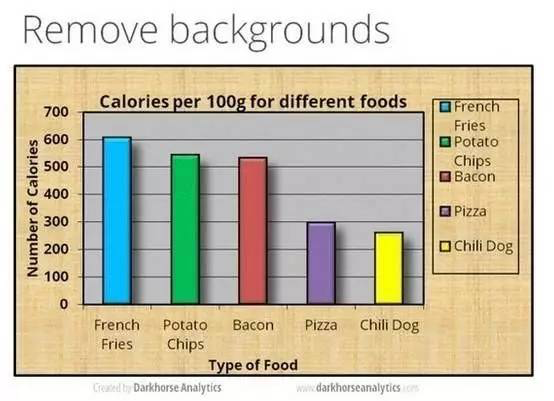

*2017-02-18* *邵云蛟* [旁门左道PPT](https://mp.weixin.qq.com/s?__biz=MzU2ODEyNzY3Mw==&mid=2247485980&idx=1&sn=8a412444504053450bd58f2956c56684&scene=19##)

在 PPT 设计中，表格是一个很棘手的设计元素，即便对于很多经常做幻灯片的人而言，也是如此。一般来说，其他页面往往做的非常美观，而一旦遇到表格页，就很难出彩。为什么这么说呢？

因为对于表格来说，有3个方面比较难于处理。哪3个方面呢？

**1，表格的形状，比较单一。通常都是矩形。** 

**2，自带背景，经常与幻灯片风格不搭配。** 

什么意思呢？比如说在一套全图型的 PPT 页面上，如果需要展现表格，往往看起来很别扭。

**3，表格内容有多有少，而且，在一页幻灯片上经常只有一张表格需要展现。** 

比如这张：

**所以，很多时候，我们在幻灯片页面上见到的表格，通常都是这副模样：**

而在一套幻灯片中，处理得当的表格页面都是什么样呢？我找了一些案例，供你参考：

可能很多旁友们，看完这些案例后，依然会觉得，**单从每一页来看，这些表格也不是很惊艳啊？**

对，的确如此，这些页面上表格的制作难度几乎为0，**但为什么我说，这些是处理得当的表格呢？**

因为在 PPT 中，**表格和图表一样，都是不要浓墨重彩进行设计的元素，越用心，处理痕迹越明显，反而看起来会越丑陋。**

越用心，越丑陋的典范之作

另外一个原因，之所以说它们处理得当，**是因为这些表格与其他页面的设计效果保持了一致，也就是说，这些表格在一整套的幻灯片中，看起来非常协调。**

我在这里要分享一个设计上的概念，叫做 **「融合度」。**

> **什么意思呢？也就是说，一套幻灯片中的每一页 PPT 能否呈现出一致的视觉形象，让人看完之后，能够产生「这一套幻灯片的风格保持很完整」的感觉。**

好了，明白了这个概念之后，我们再回过来思考，上面一些处理不当的表格，他们为什么看起来不是很顺眼呢？

**其实，就是因为表格页面没能够与其他页面保持一致的视觉形象，融合度较低。**

那么，怎么才能提升表格页面与整套幻灯片的融合度呢？跟各位分享3点经验。

**1，与其他页面的版式保持一致**  

很多时候，表格页面之所以看起来很奇怪，往往出在版式不一致的问题上。那么，什么是版式一致呢？

**通常来说，一页幻灯片的版式是这样的，分为导航区，页边距，版心3个部分，而版心是展现内容的区域。**

那么，**如果想提升表格页面，尤其是只有一个表格的页面与整套幻灯片的融合度，那么，保持版式一致是必须的。**

给各位举个例子。

我们以最后一页的表格为例，借助参考线，我们可以看到，页面的版式极度不统一。

而当我们对其进行进行版式一致化处理之后（第一页拆分成了两页），我们再来看下效果：

**2，表格的色彩与设计样式保持统一**  

我之前写过一篇单个表格处理技巧的文章，[PPT高手和小白在处理表格时，都有什么差别？](http://mp.weixin.qq.com/s?__biz=MzIwMDI0MTQxOQ==&mid=2650591466&idx=1&sn=5bc513af3c71262d75ee118d0254d749&chksm=8e88488eb9ffc19844ad2e42fada3c625c065379e987254c9aa2ff2d3dbcad85d9aef763b70f&scene=21#wechat_redirect)如果有需要，欢迎阅读，我在此不重复赘述。

**3，在图上放置表格，应该怎么处理？** 

估计很多旁友都遇到过这个问题，想要采用图片作为一套幻灯片的背景，但是呢，从设计上来讲，表格属于点线面中的面，也就是一个纯色色块，**放在图片上，很难实现与其他页面的搭配。**那么，该怎么办呢？其实解决方案很简单。

**第一种方法，调整表格背景的透明度。**

给各位举个例子。比如我们看到下面这页幻灯片，因为页面内容很单调，缺乏视觉表现力，所以，视觉冲击力不强。

假如咱们考虑为这一页幻灯片配图，**增强视觉表现效果，同时，因为要兼顾版式的一致，**所以，我们可以通过调整表格底纹的透明度来实现：

当然，在这里建议，表格的底纹色彩，尽量选择深色，否则，会导致表格内容阅读障碍。

**第二种方法，索性去掉表格的背景，如果有必要，甚至可以去掉表格边框。**

当然，表格只是规整信息的一种形式，如果整套幻灯片的版式比较多样的话，其实，去掉表格底纹也是一种很好的处理方法。

什么意思呢？给各位举两个例子。

比如，我们看到这样一张幻灯片，表格底纹遮盖了背景图片，反而干扰了图片传达视觉信息的功能：

那么，如果我们将表格的底纹设置为【无填充】，当去掉了遮挡图片的色块，再来看看，视觉效果是不是会好很多？

再比如，同样地，表格底纹遮盖了背景图片，显得很突兀。

去掉表格的底纹和边框之后，我们再来看下：

以上，就是旁门左道工作室研究出来的，多页幻灯片中，表格处理的技巧。我再唠叨一句，**表格的问题，更多反映出的是版式，配色以及与页面融合度的问题，而不是表格本身。为什么这么说呢？因为表格跟图表一样，不太适合过度设计。**

好了，这篇文章就写到这里，如果以后发现有不足或遗漏之处，我会再补充。