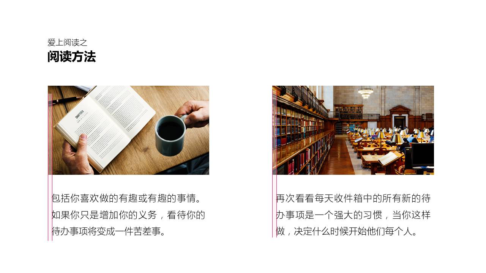

原创 *2017-11-02* *邵云蛟* [旁门左道PPT](https://mp.weixin.qq.com/s?__biz=MzU2ODEyNzY3Mw==&mid=2247487220&idx=1&sn=d4cfa11c552b6b554eb7c3ff053d1678&chksm=fc93f722cbe47e34140d9efdd85a71cbead5413944d13d63e4944460823bf2858b693d7c2036&scene=21##)

```
PPT 排版中，在页面的版式框架方面，很多人应该做的都差不多，无非就是上下布局，左右布局等。但是，为什么在排版中，仍旧会有美丑之间的差别呢？

其实，据我的观察，所谓优秀的排版，无非就是细节处理的非常赞。而这，正是大多数人容易忽略的地方，所以，有必要写一篇文章，来提一下这些小细节。
```

OK，废话不多，咱们进入正题。咱们先来说第一个细节。


### 标题和正文的字号设定


在排版时，为了能够体现出层次，通常来说，我们会为标题文字设置较大的字号，正文字号相对会小一些。但是，不知道你是否想过，**标题和正文的字号，到底应该设置为多大呢？**

很多人可能会随意地设定，但我我想说的是，这样不好。据我的经验，在 PPT 排版中，这里有一个大致恒定的比例，**那就是，****标题字号是正文字号的1.5倍。**

比如说下面这个段落：


用到 PPT 实际场景中，也会非常合适：


当然，还有其他案例，比如说下面这个：


它们遵循的排版原则，都是**标题字号是正文字号的1.5倍。**明白了吗？ 


### 页内元素的间距小于页面左右边距


这个点是什么意思呢？解释起来会很啰嗦，咱们直接上一个案例来解释。

比如我们看到下面这页幻灯片，在排版中我们都会遇到，页面上要摆放几个元素，那么，**这几个元素之间的距离到底应该多大呢？**


这里有一个恒定的规则是：**B<A即可。**而至于为什么元素间距要小于边距，是因为，这样会让页面上的内容，**在视觉上产生关联性，否则，看起来就会很分散。**


### 大段文字如何排列才更加整齐


这是一个很常见的情况，页面上遇到大段内容了，可能会由于标点符号，英文单词，数字等存在，导致页面边缘难以对齐，显得很乱。那么，这时候该怎么办呢？

很简单，我的经验是：**对文字段落设置两端对齐即可。**

如图：


> 操作步骤为：选中段落 > 点击   段落   选项卡，将对齐方式更改为   两端对齐   即可。

看个实际的案例。排版是不是很整齐，对不对？


这招特别好用。


### 分散对齐时保持一个字的间隔


先来解释下，什么叫做分散对齐。

**所谓分散对齐，是指文字随着栏宽平均分布的一种排列方式。**看不懂也没关系，给各位举个例子，你就懂了。

如图：大家可以看到，不同于居中对齐，这里的标题文字『**移动重塑世界**』是分散排列的。


那么，问题来了，分散对齐时，应该分多散呢？字与字之间的距离应该是多大呢？很多人可能会选择与『**2017全球移动宽带论坛**』保持一样的宽度。

但这样不好。我的经验是，**不要过宽，保持一个字的宽度即可。**


至于为什么要保持一字间隔，是因为，如果文字间的距离过大的话，会导致别人在阅读起来特别不顺畅，因为这时候，**别人不是读一句话，而是挨个地阅读每一个文字。**


### 如何确定内容的行间距大小？


这个问题很常见，不过，处理方法很简单，我用一句话概况就是：

**字号越大，行间距越小，保持1倍即可；**

**字号越小，行间距越大，保持1.5倍即可；**

 

什么意思呢？举个例子。比如我们看到下面的这张幻灯片：


还有上篇文章中的一个例子：


视觉效果很不错，对不对？但是，如果你留意内容排版方式的话，其实，可以发现，**标题和正文内容的行间距是不同的。**

那具体是多少呢？很简单，就是我前面说的那个规则：


标题1.0    /    正文1.5

就是这么简单。


### 标题装饰物的线条粗细如何确定？

 

这是什么意思呢？为了便于各位理解，我还是拿一个案例来去解释。

我们在做 PPT 的时候，尤其是封面的时候，会喜欢加一些装饰的线条，比如下面这个例子中的不封闭矩形：


但是，不知道你是否想过，**这个线条的粗细应该设置为多少呢？**

很简单，我的经验是，**与文字的笔画粗细保持一致即可。**比如大家看下面的这个例子：


 用在 PPT 中，也会非常合适：


当然，至于为什么要保持与笔画同粗细，很简单，**如果线条过细，或者过粗，都会让页面的排版风格显得不协调。**

就这么简单。


### 文字段落的长度如何确定？

 

这一点对于大段文字内容的段落来说，一定要注意。很多时候，如果页面上有一大段文字内容，**大多数人的做法可能是从左到右拉到尾。**

就像下面的这个例子：


但是，你知道吗？如果文段长度过大，看起来会很费力。正确的做法呢，**是保持版心的三分之一，最大不要超过二分之一。**


 文段占据版心长度的二分之一

做成幻灯片，效果会好很多，尤其在阅读体验方面，会很舒服：


就这么简单。


### 基准对齐与视觉对齐

 

我们知道，PowerPoint 软件提供智能参考线，在文段对齐的时候，会自动出现一条基准线。但是，你知道吗？**由于软件默认的文本框内部存在0.25CM的边距，所以，在排版图片和文字段落时，是不可能对齐的。**

比如下面的这个例子：



 如果想要保持视觉对齐，有两个办法：

① . **对于图文排版来说。**将文本框的上下左右间距设置为0，这样，我们就能够保证图片和文段保持对齐。

大家可以仔细地对比下上面两个例子：


> 操作步骤为：选中文本框 >   **设置形状格式**   > 在    **文本选项**    中将间距改为0即可。

② . **对于不规则形状的排版。**这个就有一定难度了。咱们借助下面这个例子来详细说说：


我们可以看到，每一个 LOGO 的尺寸都是不同的，有长的，有高的，有扁的等等。如果想要排版的非常整齐，**我们就要按照 LOGO 的主要视觉面积进行排版。**

大家可以认真地看看下面的这个例子：

 

 那么，怎么才能按照主要的视觉面积进行排列呢？分享一个小方法。

**那就是把 LOGO 给模糊。**这样，就会隐去一些图片上，细枝末节的内容，呈现出来的就是主要的视觉面积，然后，进行排列即可：


方法呢，就是这么多。建议呢，大家可以找些案例，好好练习一下。

这篇文章里有一些点还是需要动点脑子才能理解的，当然，如果有不懂的地方，可以在留言区问我。

以上。