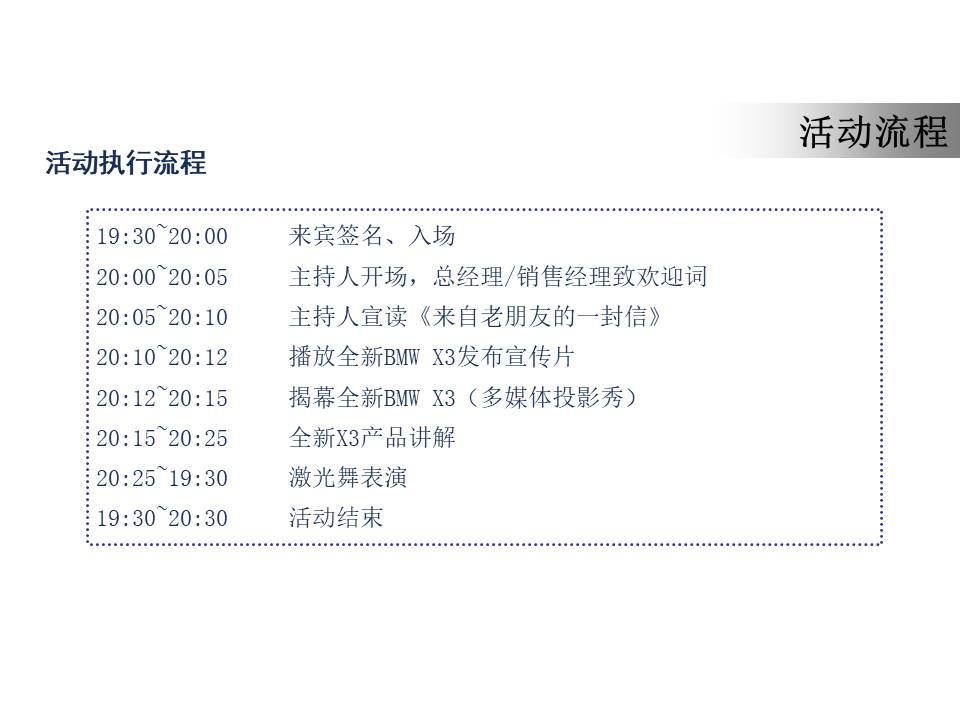
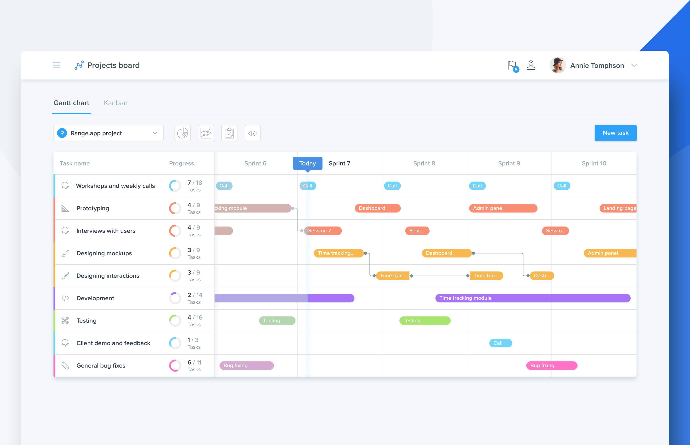
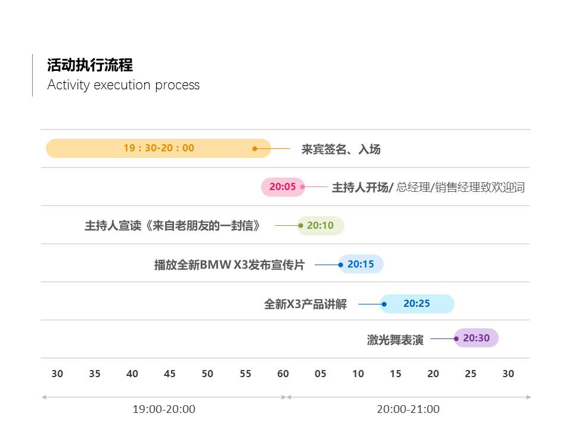
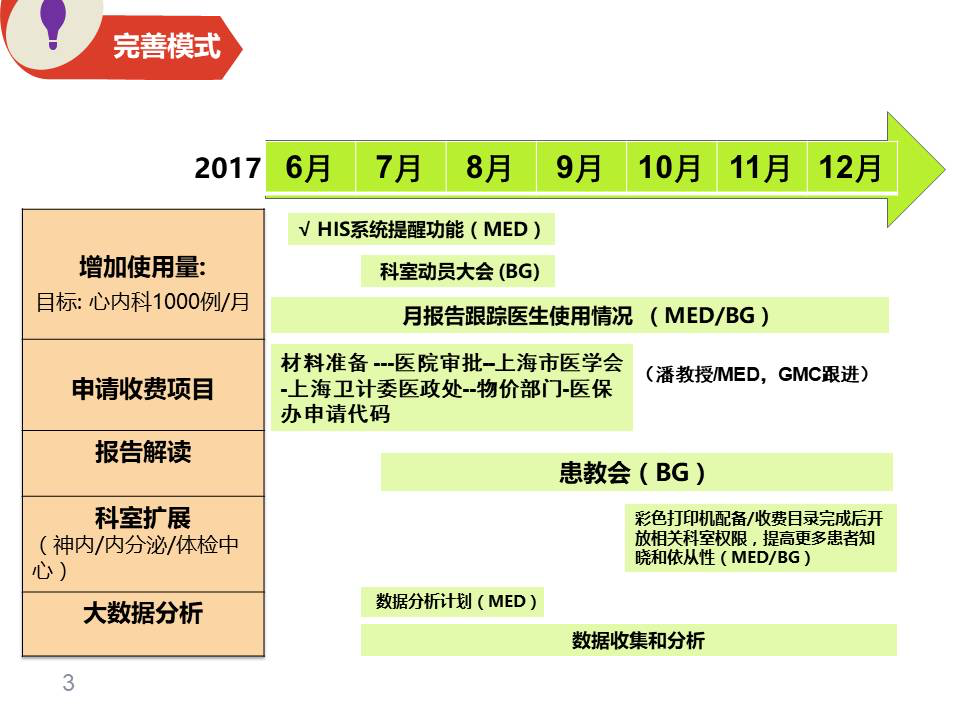
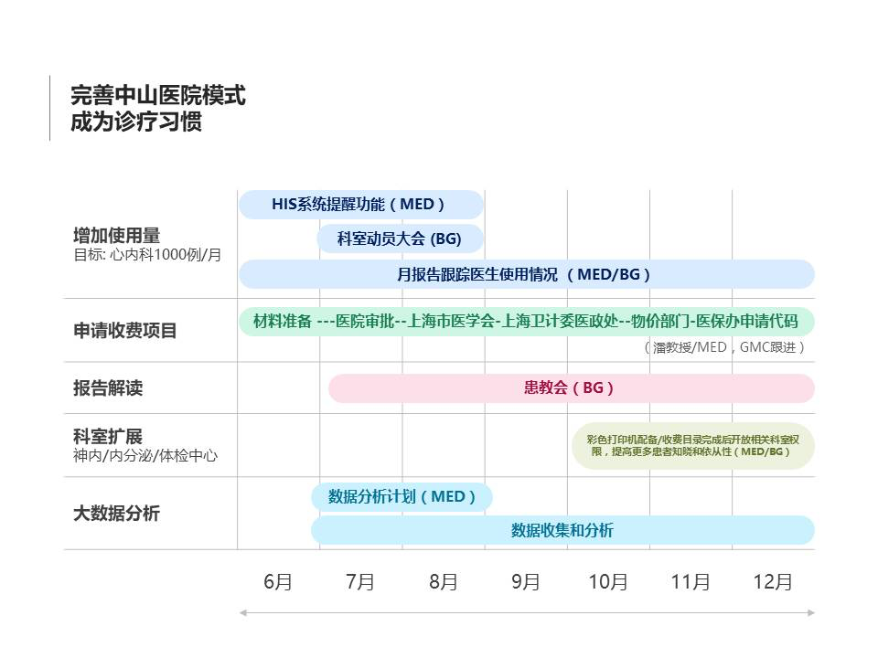
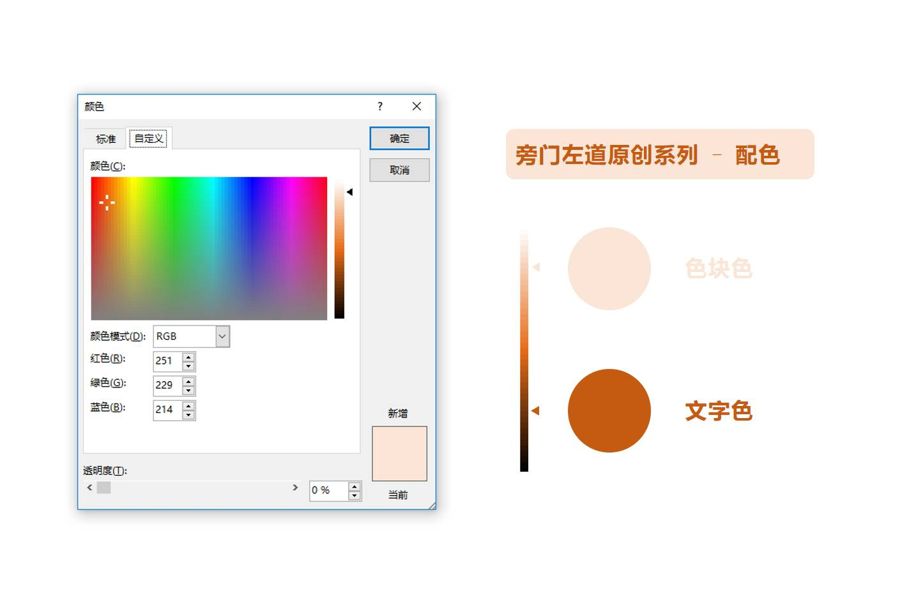

经常在PPT中会遇到带有时间刻度的表格，每一个刻度后面还跟着若干个事件，排版结果总是乱糟糟的。

鉴于这个问题很典型，估计很多人都会碰到类似的问题，因此，我觉得有必要，单独拿出来说一说这个点。

先来上一张相似的

对于这种带有时间刻度的表格，如果我们单纯地将时间和对应的事件，放入相应的表格框内，看起来未免有些枯燥，而且呢，缺少视觉化的表现。

那么，该怎么来解决这个问题呢？很简单，在这里给各位引入一个概念，叫做   甘特图    。什么叫   甘特图    呢？借用百度百科的一段定义来解释：

> 所谓甘特图，就是指通过条状图来显示项目，进度，和其他时间相关的系统进展的内在关系随着时间进展的情况。

看不懂也没关系，翻译成人话，就是，**用色块条的长度来表现时间的长度，使其更具视觉化。**经常做项目管理的朋友，应该多会用到甘特图。大概长这个样子：

图片来自互联网

当然，对于带有时间刻度的 PPT 表格，如果使用甘特图来表示的话，其实，也会非常合适。所以，在这里呢，**借用两个典型案例，来跟各位聊聊，怎么用好甘特图，来绘制可视化的时间表格。**

### 案例01

这种表格属于典型的   **时间跟随型**   表格，大家可以看到，每一个事件所发生的时间挨的非常紧密。

那么，对于这种表格，如果需要对其进行优化，结果大概是这样：

**至于为什么这么做，有几个要点：**

a. 色块条内只写上时间。因为如果写文字的话，空间不够。

b. 色块的排列顺序，采取从上之下，隔行相连的原则。

c. 事件的文字内容的位置与时间同行，标注在周围。

就这么多。这是第一种常见的情况。

### 案例02

这种表格属于典型的    时间间隔型    的表格，典型的特点是事件**持续的时间较长**，大家可以看到，每一个事件都能横跨好几个格子，而且，事件交替发生。

那么，对于这种类型的表格呢，如果需要对其进行优化，结果大概是这样：

**至于为什么这么做，也有几个要点：**

a. 色块条内写事件内容，而非时间点。

b. 表格内同时使用横纵线条，横线的作用是分割项目，纵线的作用是更加清晰地界定时间的起始点。

当然，除了上面的制作要点外，还有一个关于   甘特图色彩搭配   的方法，在这里也分享出来。

通常来说呢，因为甘特图常用来表示不同的项目，那么，**为了区分不同的项目，建议使用不同的颜色。**通常来说，色块的颜色较浅，而每一个色块上的文字颜色，建议选用较深的颜色。这样会比较有反差性。

那这些颜色怎么选呢？举个例子。

比如色块用了浅橙色，那么，文字的颜色，就在    其它颜色    >     自定义颜色    中，选择较深的颜色即可，如图所示：

就这么简单，就可以轻松地完成甘特图配色。

明白了吗？方法就这么多，**无非就是在原生表格的基础上，插入一些色块，以此，就能让时间的概念变得更具视觉化。**

当然，如标题所写，这是表格案例优化的第一篇，以后还会有（二），（三）......，欢迎持续关注。

好了，关于表格，还有什么问题，欢迎向我提问。