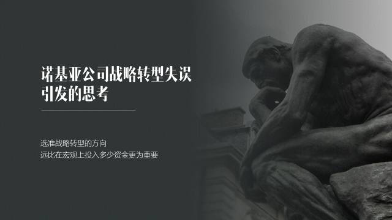
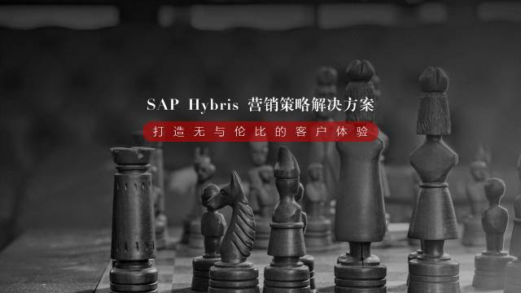
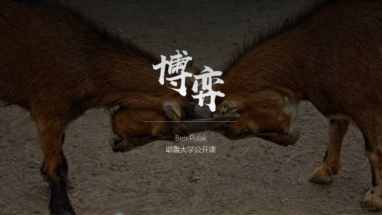
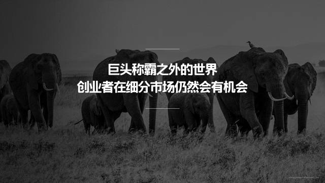
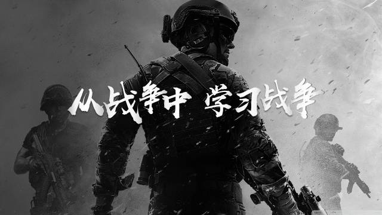
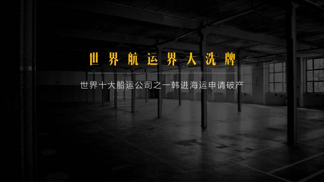
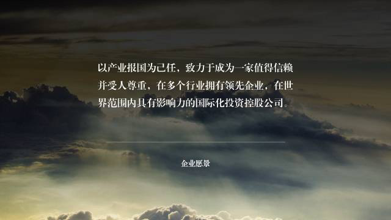
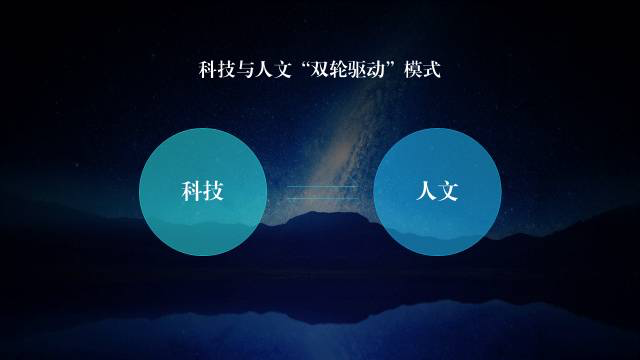

在 PPT 制作中，图片的重要性不言而喻，优质的配图可以迅速提升幻灯片的档次。而如果你看到过一些优秀的幻灯片作品，你会发现，除了排版整齐，风格突出之外，图片往往会成为一套幻灯片的亮点。

**那么，如何才能才能找到优质的 PPT 配图呢？**

有些人可能说说，要远离百度之类的泛图库，也有人可能会说，要去专业图库网站。但其实，你知道吗？

**图库本身并不能帮你找到优质图片。**

因为无论是 PPT 高手也好，亦或是小白也罢，往往使用的是同样的图库，可能同样是去 500PX 、也可能同样是去 unsplash 。那么，为什么有些人能找到优质图片，而有些人找的图片看起来却很 LOW 呢？

**其实，问题往往出在图片搜索的思维方式上。**

掌握正确的搜图思维，才是找到优质配图的关键所在，那么，在搜索图片时，都存在哪些思维方式呢？我认为你需要知道4种搜图思维。

### 01 具象化配图  

在做 PPT 时，我们常常会遇到一些抽象化的概念，比如产品生命周期、企业营销策略等，对于这些概念而言，往往缺乏与之匹配的视觉化图片。

**因此，面对这种情况，我们就需要借助一个实体，把抽象概念具体化，用具体的元素来表现出抽象化概念。**

什么意思呢？给各位举几个例子。

比如面对思考这一抽象概念时，我们可以借助罗丹的雕塑作品《思想者》来予以表现：

再比如面对营销策略方案这一抽象概念时，我们可以借助具象的棋盘来予以表现：

再比如面对品牌差异化这一抽象概念时，我们可以借助不同色彩的元素，比如伞来表现：

当然，还有一些例子，比如：

用具象的海龟来表现抽象的产品生命周期较长这一概念；

用具象的金鱼来表现出抽象的记忆力差这一概念；

用具象的地标建筑来表现出抽象的国家或城市这一概念；

......

在此，不一一列举。

### 02 场景化配图

同样地，这种方法也是来把抽象概念具体化，但是与上一种方法不同之处，**在于它借助的是一些场景，而非单个元素。**

什么意思呢？也给各位举一些例子。

比如我们可以使用具象的**山羊顶角的场景**，来表现出**博弈**这一抽象概念：

再比如用具象的**直播场景**，来表现出抽象的**网红经济**这一概念：

再比如用**具象的动物行走的场景**，来表现出抽象的**巨头和创业者竞争**的概念：

当然，这种方法种提到的场景，**可以是大脑印象中的场景，也可以是电影、电视剧甚至游戏场景等，只要能够激发观众的感性联想即可。**

比如之前分享过的这张 PPT ，借助的就是游戏场景：

> 来源：涛说 PPT

### 03 结果化配图

什么叫结果化配图呢？也很简单，就是说，**我们在为文案进行配图时，考虑的是文案内容被执行后所导致的结果，而非文案本身所传递的含义。**

什么意思呢？同样地，给各位举几个例子。

比如我们可以用空荡荡的厂房来表现出企业破产的概念。

**这里的空荡荡就是破产后所导致的结果。**

再比如，可以使用微笑的照片来表现出用户满意度较高的概念。

**这里的微笑，就是用户满意度高所产生的结果。**

再比如，用医院病房的病人来表现出流感传染的概念。

**这里的病人就是感冒所产生的结果。**

### 04 意境化配图

这种配图方法，**往往被用来搜寻背景图，以衬托一种气氛，并不表现实际的内容含义，就是简单地烘托一种感觉而已。**

什么意思呢？给各位举几个例子。

比如很多时候，在制作企业简介或者之类的 PPT 页面时，往往**喜欢使用云里雾里的天空**用作背景。无非就是表现出一种大气的感觉：

同样地，再比如**很多科技企业喜欢使用星空作为背景**，无非也就是为了表现一种深邃未知的感觉：

以上，就是常用的4种配图思维方式，再来总结一遍，分别是：

- **具象化配图**
- **场景化配图**
- **结果化配图**
- **意境化配图**

最后，再提醒一句，当你掌握了真正有效地搜图方法，才能够更好地用好图库网站。否则，收集再多的网站，也都没什么用途。

最后的最后，推荐两个我常用的图库网站：

- **unsplash.com**
- **pexels.com**