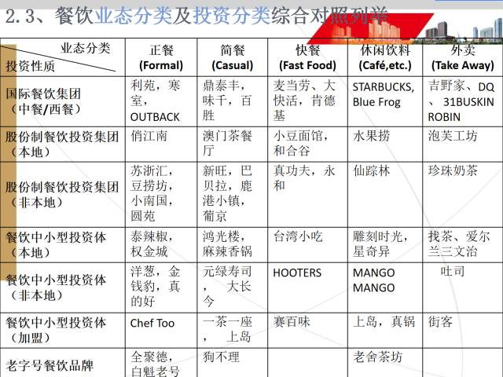
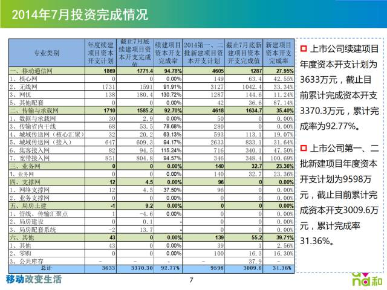
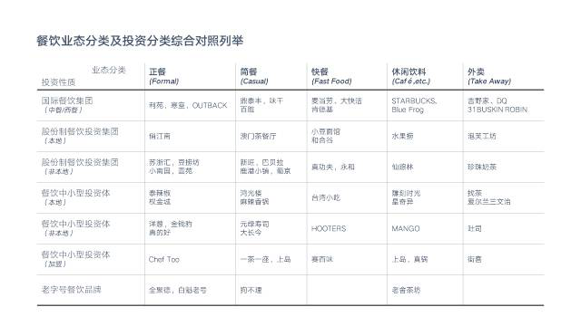
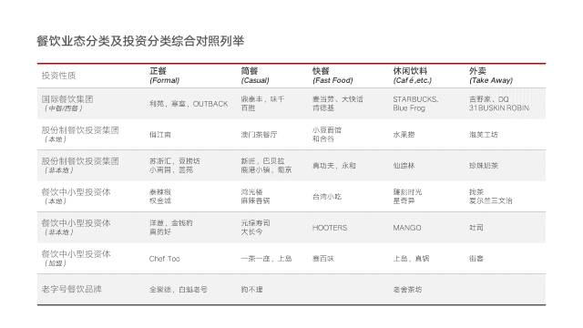
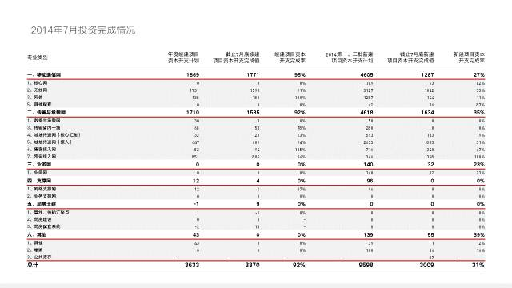
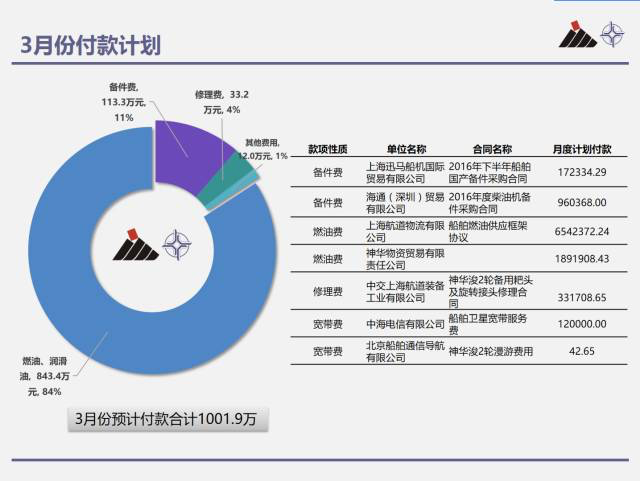
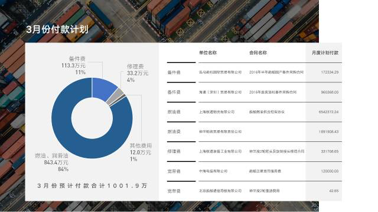
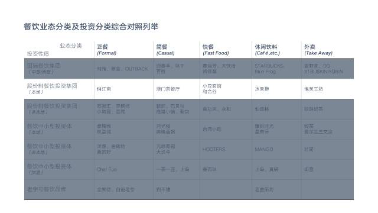
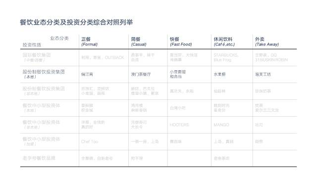
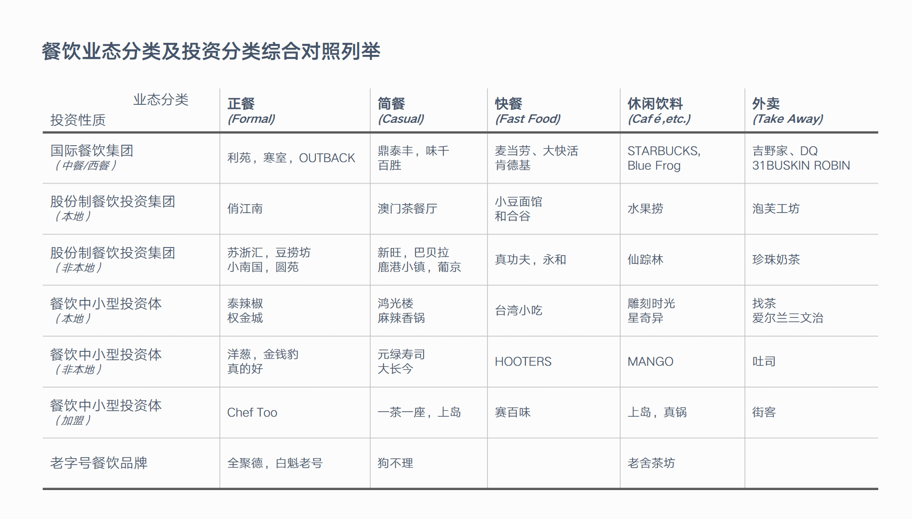

原创 *2017-10-19* *邵云蛟* [旁门左道PPT](https://mp.weixin.qq.com/s?__biz=MzU2ODEyNzY3Mw==&mid=2247487101&idx=1&sn=c8de73b95cf909e84fd9447505a0942e&scene=19##)

众所周知，表格作为一种好用的信息规整工具，在整理 PPT 内容方面，可以说非常方便。但是你知道吗？**当表格中塞入大量内容时，由于密密麻麻的全是文字，就会导致信息超载，没办法突出重点。**

就像这样：

还有这样：

对于这样的表格，就**跟典型的 Word 型幻灯片差不多，**让人丝毫没有想要读下去的欲望。

好了，那么，怎么才能够提升表格的颜值，让它更加清晰地表达重点呢？给各位分享4个经验。

### 01 利用线条和色块

这一点是什么意思呢？很简单。**表格内容之所以重点不清楚，是因为缺少排版。**那么，我们可以将排版文字的手法用在表格排版上，就能够让表格内容更加清晰。

给各位举几个例子。就拿上面举的反例来说吧：

对于这张表格，我们可以**借助不同粗细或者是不同色彩线条的搭配，来区分页面的重点和非重点内容。**

比如说做成这样：

不同粗细的线条

不同色彩的线条

当然，还可以**借助不同颜色的色块搭配，也能起到相同的作用。**

又比如说上边举例的第二号表格：

如果我们单独把页面中的表格提取出来，进行排版。**我们可以采用灰白相间的色彩，来体现出页面的层次感：**

同样地，再比如这个案例，它的问题也是表格排版不能突出重点：

我们可以借助粗细有别的线条，对表格进行重新排版：

### 02 利用遮罩掩盖

这是什么意思呢？**所谓遮罩是指，我们可以在非重点内容上面，加一层透明色块，**以此，来突出重点内容。

还是拿个案例来详细说明。我们可以看到，没被遮盖的部分，自然而然，就成为了重点内容：

### 03 利用灰色弱化

原理与上面的方法相似，都是采用**弱化非重点内容的方式，来突出重点内容。**

举个案例来说。把**非重点部分内容的色彩变浅之后，重点自明。**

### 04 利用动画强调

如果我们需要**逐行对表格内容进行讲解**，那么，为了让重点更加清晰，我们也可以借助动画来实现目的。

什么意思呢？比如说，我们可以**让色块逐行地进行出现，以此，来凸显表格内容重点。**同时，还能向别人传递出，目前已经讲到了哪一部分：

当然，更多时候，可能大多数人的做法，**是在重点部分的表格处，画一个红线框，或者是使用大红大绿的色块进行填充。**

这样做，虽然能起到同样的目的，但是，这种作法比较过于粗糙。而且，如果同一个表格中使用了过多的色彩，也会反过来干扰内容的重点。

所以，在这篇文章中，给各位分享几种更好用的方法。希望对你有帮助。

以上。
