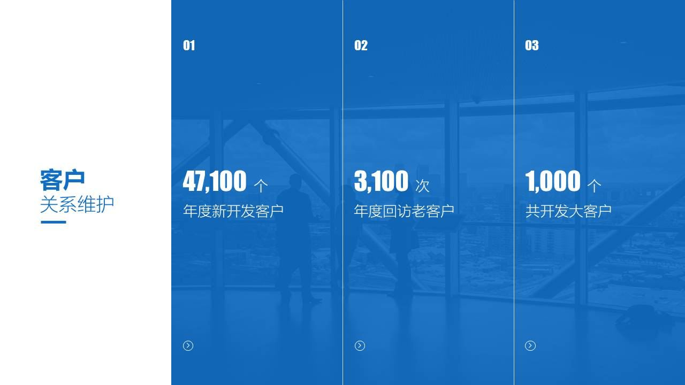

原创 *2017-12-08* *邵云蛟* [旁门左道PPT](https://mp.weixin.qq.com/s?__biz=MzU2ODEyNzY3Mw==&mid=2247487495&idx=1&sn=e469d1aa682a96a4820ca47f369450d0&scene=19##)

想必各位都知道，PPT 内容排版的方式有很多，同一段内容，拿到不同人的手里，呈现出的排版结果可能都不尽相同。但这篇文章，我只想跟各位分享一个，我最近很喜欢的排版方式，个人觉得很实用，**尤其对于内容较多的页面，**更是非常适合。

是什么呢？不废话，直接进入正题。

我管这种排版方式，叫做    **分栏排版法**  。什么意思呢？

> **就是说，我们可以按照内容的不同含义，把页面分成不同的栏，用栏来承载不同的含义的内容。**

这是我自己下的定义，看不懂也没关系，给各位看一些例子，你就差不多会明白。比如下面这些：

白蓝蓝蓝四块

蓝白灰三块

大家看到了吗？**页面被分割成了不同的色块，每一块都承载了不同含义的内容，这就是页面分栏。**很简单，对不对？

但是，读到这儿，可能很多人，想要问的一个问题是：**为什么要把一个页面分成不同的块呢？直接把全部内容放在一大块上不好吗？**

我来解释一下。为什么要分栏呢？

很简单，因为对于大多数人来说，由于缺乏一定的排版思维，一旦遇到很多内容的PPT，内容的展现形式，就会乱七八糟地交织在一起，导致，缺乏视觉上的条理性。**通俗点讲，就是看起来很乱。**

但是，如果我们对内容进行分栏，把不同部分的内容，归类到单独的一栏中，就会有很大不同。

举两个前后对比的案例，这样大家看的会更加直观一些。

比如原稿是这样，内容被笼统地放在了一起：

那么，把不同类别的内容分栏之后，立即大变样，视觉上也会更加直观，对不对？

再比如，原来是这样：

内容非常多，且缺乏重点，但是，当我们对内容进行分区之后，阅读效果会好很多。

这就是为什么分栏排版法很实用的一个地方，就跟收纳盒整理凌乱的物品是一个道理。**因为，不同含义的内容，被放到了不同的栏中，就会显得很整齐。**对吧？

那么，如果你下次在做幻灯片时，也想用到这个我独家发明的方法，该怎么才能用好呢？分享几个提示。

**1. 页面上至少要有两个或者两个以上不同含义的内容。**

因为分栏的主要作用，**就是为了让内容的展示更有条理性，更加结构化，**如果页面上只讲了一个点，那么，何必再分栏呢？对不对？

所以说，页面至少要有两栏：

**2. 规划页面到底分几栏前，要提前对内容进行结构化梳理**

**内容的结构化梳理，是确定页面分几栏的前提。**如果页面内容包含3大方面，那么，很明显，页面就要分3栏。

比如下面这个例子，就是经典的3栏布局：

**3. 色块颜色的选择，要有一定的含义**

什么意思呢？就是说，如果页面内容分主次，那么，主要内容选择彩色色块，次要内容考虑浅色色块，**这样，以便于凸显主要内容。**

比如下面这个例子，很明显，蓝色是强调色：

如果页面内容是对比关系，**那么，颜色尽量也要有所区分，能够体现出对比。**

基本上，注意上面这3点，就差不多了。再次强调一遍，这个方法，真的很好用，虽然只是简单地用色块把内容分成了不同的栏，但是，最终做出的效果，肯定会大不一样。

最后，再啰嗦一句，这个方法叫做    **分栏排版法**  。

以上。