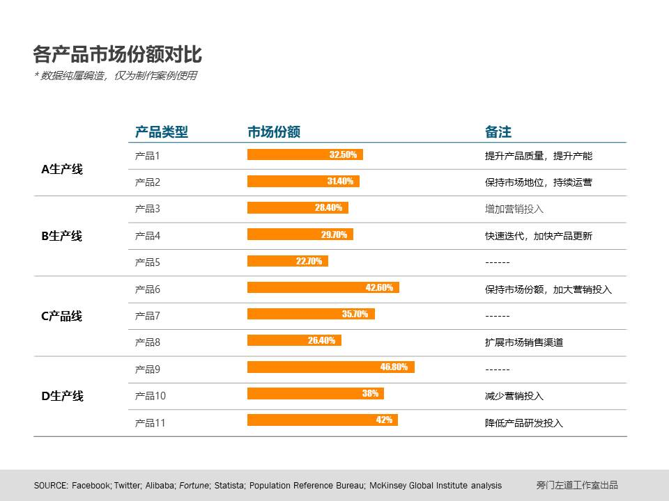

原创 *2017-12-15* *邵云蛟* [旁门左道PPT](https://mp.weixin.qq.com/s?__biz=MzU2ODEyNzY3Mw==&mid=2247487526&idx=1&sn=b7ba4dae84711c7e2afb273c77d7047a&scene=19##)

年终总结马上就要来了，PPT汇报在所难免。而如果想要做好年终汇报 PPT ，自然离不开数据图表的使用。

如果业绩足够喜人，那么，你怎么说都行。但是，如果业绩并非想象中的那么圆满，但又不想表现的那么“难看”，比如说：

- 竞品销售数据大幅度超越本公司产品，怎么做才能弱化数据之间的差距呢？
- 产品增长数据远低于其他产品，怎么做才能凸显自身优势？

对于上面的这些状况，不知道你是否想过，这时候该怎么办呢？在这里，我分享8条可行的数据图表补救的方法，希望能够帮你解决燃眉之急。

**01 . 更改Y轴起点/终点数据**

 

当牵扯到数据对比的时候，我们可以使用这种方法，让数据的表现效果，显得很“好看”。

什么意思呢？比如说：

 

当业绩表现良好，但与其他数据相比，没有很大超越的时候。就像下面这个例子：

那么，这时候，我们可以将Y轴的起始数据调大，从而凸显差距。

注意Y轴的起始数据

 

另外，当业绩表现不好，相较于其他数据而言，有一定差距的时候，比如下面这个情况：

那么，这时候呢，我们可以将Y轴的终点数据调大，这样一来，差距就会显得很小，间接弱化了差距。

 注意Y轴的终点数据

这时候，我们可以将Y轴的终点数据调大，这样一来，差距就会显得很小，间接弱化了差距。

 

**02 . 用箭头暗示未来发展趋势**

当使用折线图来表现数据变化趋势时，很多人喜欢直接放上一根线条，就像这样：

但是，未来数据变化是升，还是降呢？抑或是保持平稳呢？不知道。

而如果我们为折线图末端，添加一个上升箭头。就像这样：

 

虽然不一定保证数据肯定上升，但是，会让人看起来心情舒畅。

 

**03 . 与过往数据进行对比**

 

有些时候，当我们与竞品数据相比较时，会发现自身处于劣势，甚至根本没有可比性。就像这样：

那么，这时候，我们可以换个思路，避开竞品，选择与以往数据进行对比。就像这样：

如此一来，也能够很好地呈现出自身的亮点。

另外，唠叨一点，各位在某些电商网站买东西时，是不是也经常会看到，比如较上一代处理器相比，性能提升32%之类的，对吧。

但可能真实的情况是自己的处理器都没办法跟竞品对比，太 LOW 了。

 

**04 . 呈现累计结果的数据**

 

再来说一种情况，有些时候呢，我们需要展现某产品近几年的增长趋势，可能这款产品已经开始呈现出增长减缓的情况，就像这样：

那这该怎么办，才能展示出数据亮点呢？

很简单，我们可以以面积图的形式，来呈现出累计数据的变化，这样，即便今年增长率再低，在图表展示方面，看起来也会有所提升，就像这样：

 

**05 . 表现相对增长率**

 

有些时候，当公司推出一款新产品，市场份额很低，如果呈现数据绝对值的话，那么，与竞品相比，可能可能毫无竞争力，就像这样：

但是，如果我们换个思路，避开绝对值的比较，选择对比相对增长率，可能结果就会大不一样：

而且，这个方法屡试不爽，因为基数越低，但凡有些增长，那么，相对增长率都会高很多。

**06 . 添加醒目的数据标注**

 

在使用图表呈现数据时，记住一点，千万不要仅仅把数据展示出来，因为这样，别人很难看出数据的亮点在哪里：

如果有可能地话，尽量把你想表达的数据亮点提炼出来，在图表上添加一处醒目的标注，就像这样：

当然，也可以局部添加数据标注：

这时候，别人在看到这张图表时，就会一眼看到你的业绩亮点。

 

**07 . 添加数据参考物**

上面说的例子呢，大多是数据不好的时候，我们应该怎么呈现亮点。但是，你知道吗？即便数据超好，也需要一定的手法来呈现。什么意思呢？比如下面这个例子：

乍一看，数据平淡无奇，好像没什么亮点。

但是，如果我现在告诉你，这个数据远高于行业平均水平的话呢？是不是顿时觉得很厉害？

这就是参考物的作用。

 

**08 . 表格和图表结合使用**

 

最后，再来说一种极端的情况，有些时候，当信息确实较多，而我们必须要用表格来承载的时候，就像这样：

密密麻麻的，缺少了图表的可视化效果

那么，这时候该怎么办呢？很简单，我们可以让图表和表格相结合，把能转换成图表的数据，采用图表形式表现，这样，就能够解决这一问题：

以上，就是本文的全部内容。最后，再唠叨一点，我上面说的方法，大多是工作亮点不足时候的补救方法，虽然可行，但是，还是希望各位能够依靠自身努力，做出亮点，而非“包装”出亮点。

好了，就说这么多。如果你还有其它方法，欢迎在留言区分享出来。