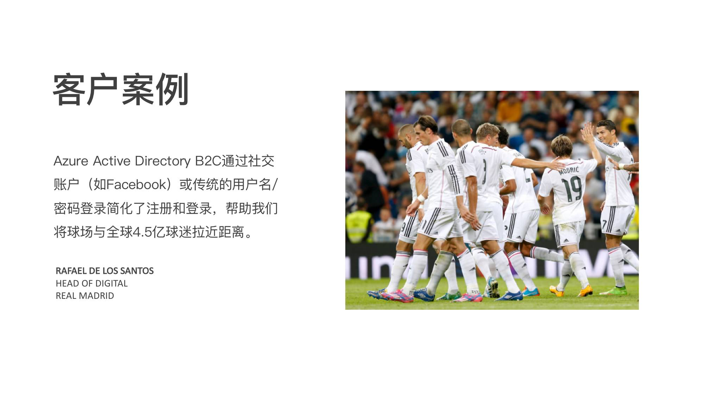
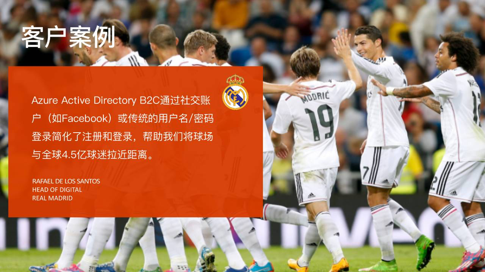
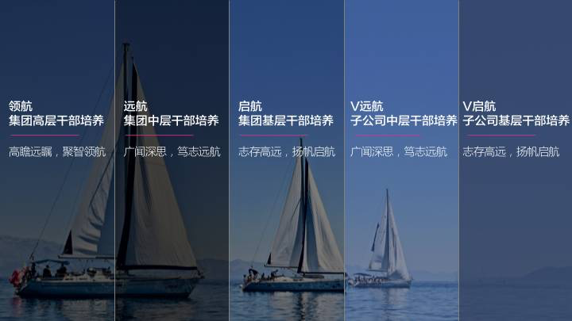
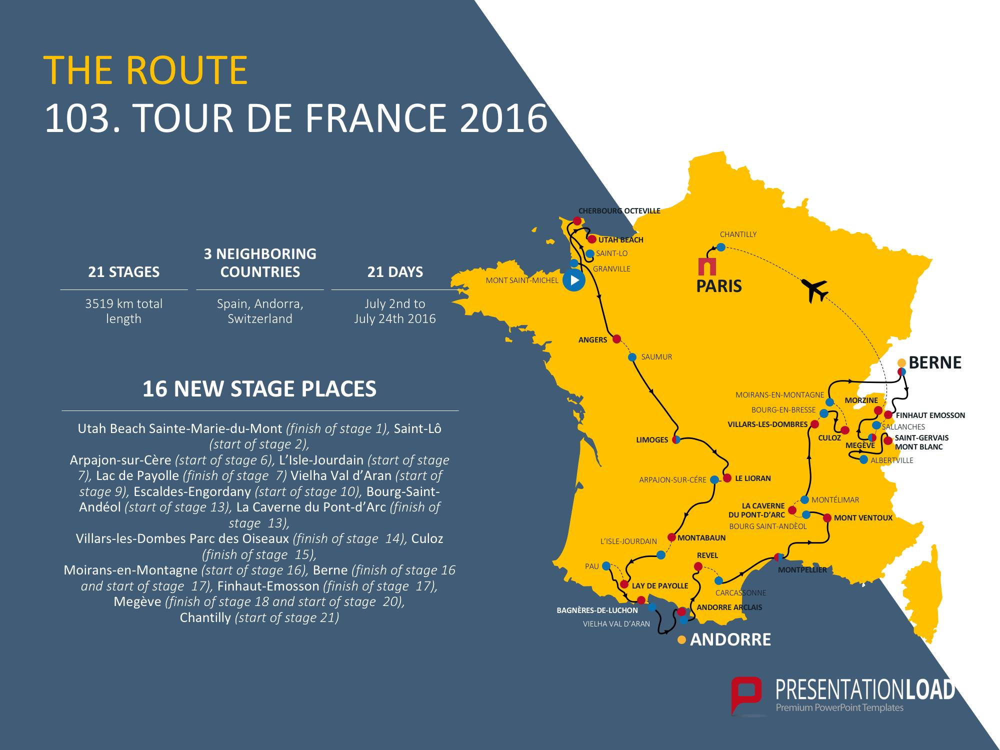

## 如何巧借形状，做出更有创意的PPT图文排版？ 

原创 *2017-11-27* *邵云蛟* [旁门左道PPT](https://mp.weixin.qq.com/s?__biz=MzU2ODEyNzY3Mw==&mid=2247487395&idx=1&sn=a519fd7bd86c325265ccdc9c882d3f04&scene=19##)

PPT 图文排版时，很多人经常会由于图片的限制或者文字内容的限制，导致排版缺乏思路，排版样式很平淡。比如下面这个：

**排版上虽然很整齐，但是，页面看起来非常单调，对不对？**

同样地，还有下面这个案例：

但是你知道吗？其实有些时候，**如果我们能够转换思路，借用形状蒙版，其实，90%的排版问题，都能够迎刃而解。**

比如下面这个优化版的例子：

蓝色色块丰富了页面视觉效果

还有另外一个优化版案例：

因为有了蒙版，我们就可以肆意妄为地制作全图型幻灯片

那么，既然蒙版在 PPT 排版中，是一个不可忽视的元素，所以，这篇文章就来谈谈，如何巧借蒙版，做出更富创意的 PPT 图文排版。这里会分享 3 个方法。

**—— 借助多色系透明蒙版 ——**

这个方法主要用在多段文本内容的排版上，**常用来表现不同的内容分类**。比如说下面这两个案例。

在页面底部只需要添加一张大图，**通过添加不同透明度的色块，来区分不同的内容部分：**

同样地，还有这一个，也是如此：

操作方法也很简单，我们只需要插入不同色彩/透明度的形状即可。但是要注意：

- 要注意蒙版的色系保持统一，比如都是深色系，但透明度要有所区分。
- 如果色块之间色彩差别不明显，建议添加浅灰色线条以作区分。

**—— 借助蒙版卡片 ——**

这种方法，主要用在单端文本或者多段文本的排版，**用来延伸页面的排版空间。**什么意思呢？

就是说，如果页面上有一张较大的图片，留给文字的空间较少，那么，你可以在图片上层覆盖一个形状卡片，把内容填入其中。给各位举一些例子。

比如对于单图+单段文本的页面，我们可以这样做：

对于单图+多段文本的页面，也可以这样：

还有，对于封面而言：

对于图表地图而言：

当然，这个方法的好处不仅仅是延伸页面排版空间，**更多的是，能够让页面显得不再单调，让页面拥有层次感。**

**—— 借助渐变蒙版 ——**

这个方法，主要是为了让图片和背景有更高的融合度，抹去图片的边界。它主要有两种常见的应用场景，挨个来说。

当用在全图形 PPT 中，可以让图片和背景融合度更高。比如说下面这个例子：

当用在小图型的 PPT 中，可以调和图片色调，让图片与整体色调保持一致。比如加一个橙色渐变的蒙版，**可以让不同色彩的图片，看起来不至于突兀：**

这就是我要说的第三种方法。

当然，蒙版的作用不仅仅限于这些，还有很多实用的玩法儿，以后找机会，会多跟各位聊聊。

以上。

再小的技能，也值得被认真对待。