*2017-11-24* *邵云蛟* [旁门左道PPT](https://mp.weixin.qq.com/s?__biz=MzU2ODEyNzY3Mw==&mid=2247487394&idx=1&sn=c7a720010456af9b61e36230ea341ede&scene=19##)

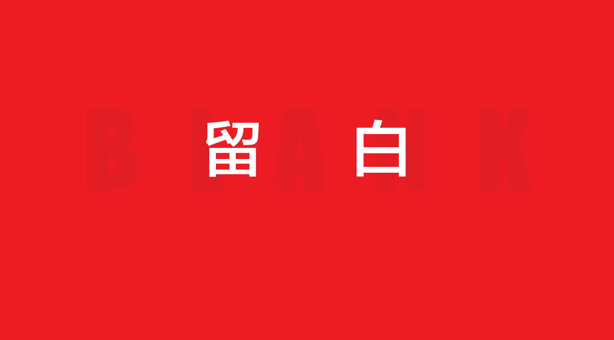

对于大多数人而言，在进行 PPT 排版时，都知道一些大众的原则，比如说：

- 标题字号要大于正文；
- 排版时要注意对齐；
- 文字段落的字体类型不超过3种；

等等。

 

可以说，这些通用的原则，是 PPT 排版的基础，只要能够遵循这些基本的原则，排版能达到60分，应该绰绰有余。

**但是，你知道吗？如果你想要让自己的PPT 排版做到更好，提升一个档次，这些通用的原则，就远远不够。因为一份优秀的 PPT 排版作品，往往会注意到很多细节方面的处理。**

 

因此，这篇文章，就来跟各位分享其中一个，看起来很小，但却非常实用的方法，那就是，**留****白。**

 

提到留白，可能很多朋友都会有一些误区，比如说：

 

- 留白就要求页面内容很少，空闲面积很大；
- 留白就要求页面尽可能地少用色彩；

等等。

 

其实不是的。更多时候，**留白指的是元素之间的距离，而这个距离，带有一定的视觉含义。**

 

什么意思呢？举个简单的例子。比如我们看到下面这张图片，就能够很清楚地明白什么叫做「**留白表示一定的视觉含义**」。

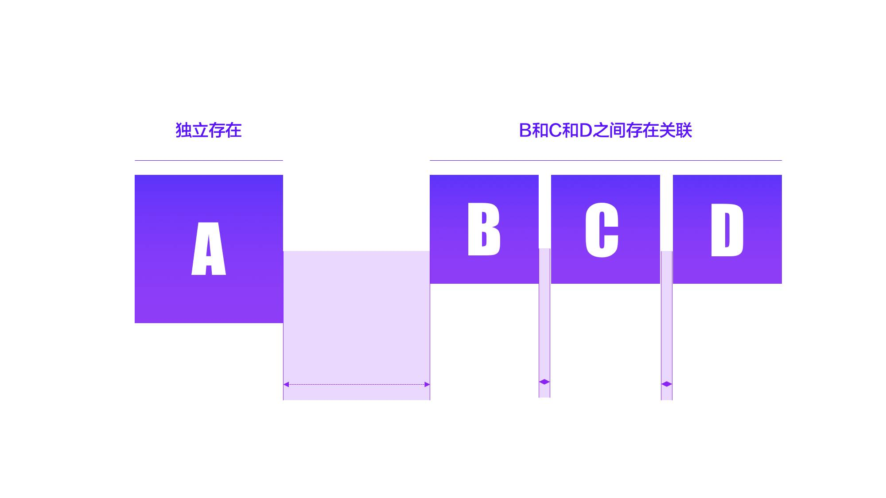

因为BCD间距相等，所以，视觉上默认三者存在关系

 

这就是留白，明白了吗？而在 PPT 排版中，**有3种跟留白相关的常见问题，是我们需要避免的，**那么，接下来呢，挨个地去说一下。

—— **01  标题和正文留白错乱**  ——

 

如果一张 PPT 页面上有好几段文字，不知道你是否想过，我们应该如何确定他们在页面上的位置关系？

 

没想过也没关系，咱们看一个例子。顺带想一想，这张页面在排版上都存在哪些问题呢？

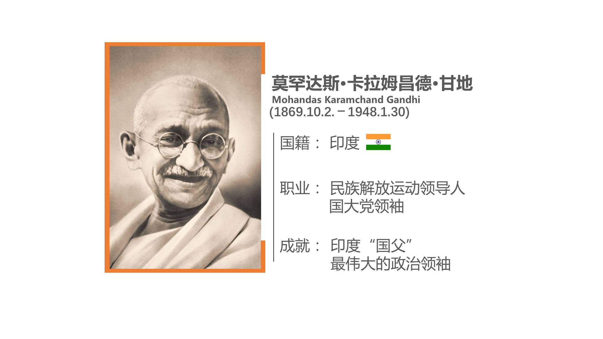

**其实很简单，这页 PPT 的问题就在于，没有明确留白所表现的视觉含义，导致排版关系有些混乱。**

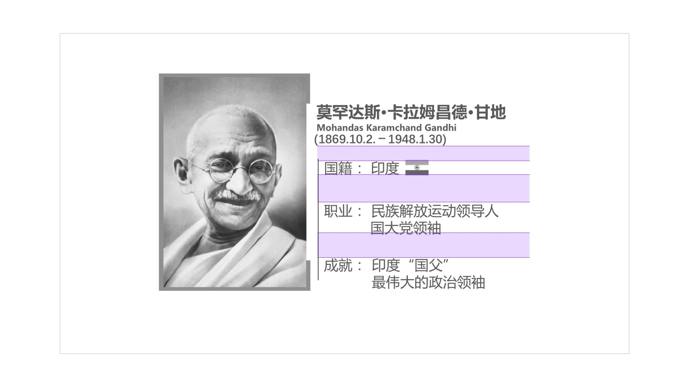

什么意思呢？为什么这样排版是错误的呢？咱们来分析下。

这个页面上，**一共有4段内容，按照亲密性原则，有关联的内容放在一起，所以，正常逻辑下，文字之间的间距关系是A>B，**就像这样：

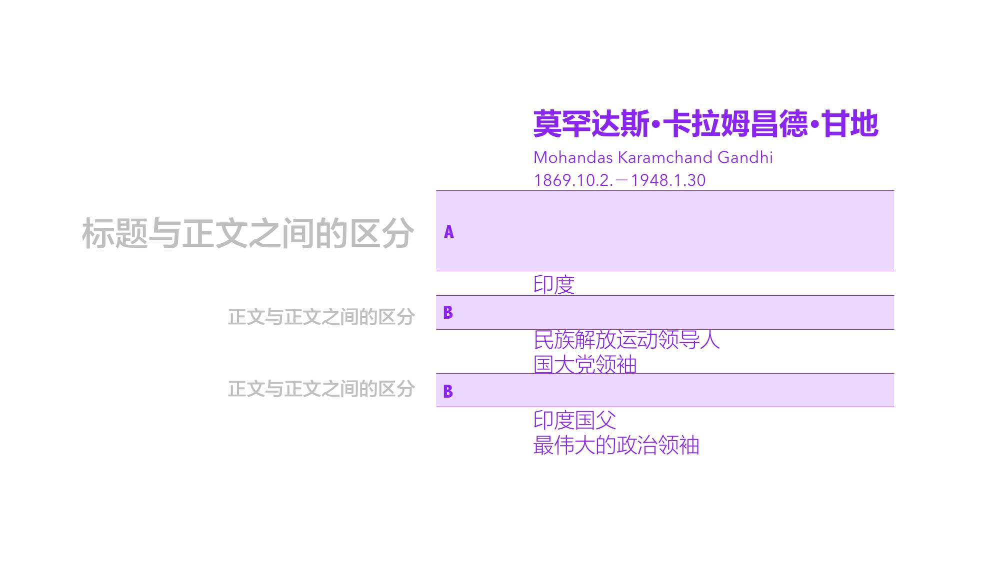

如果结合图片进行排版的话，应该是这样：

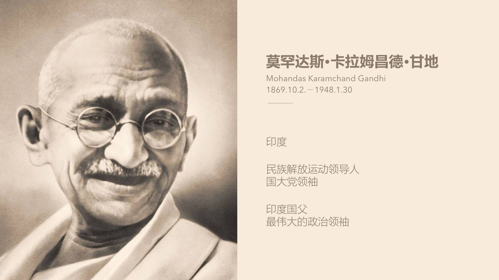

或者也可以采用居中排版的样式，都是可以的：

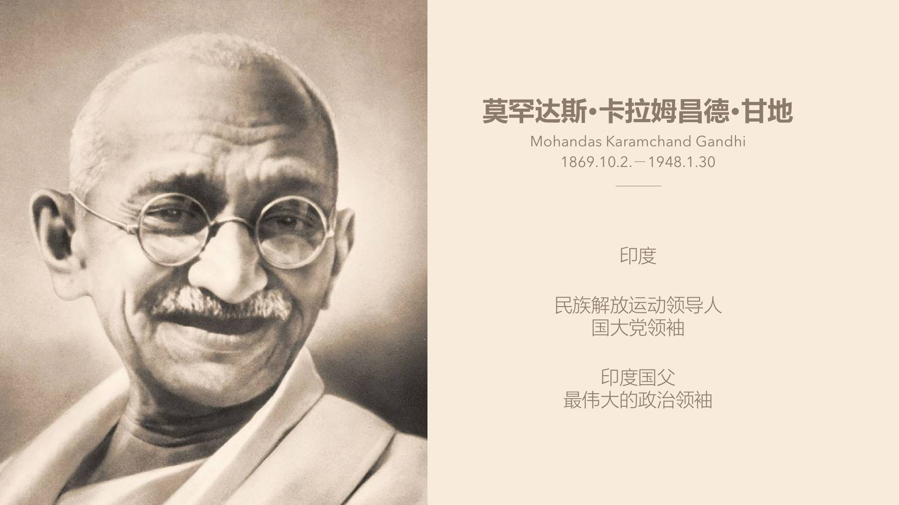

因此，我说原稿排版混乱，**主要原因是标题和正文之间的间距错乱。**

 

——  **02  标题和正文留白相等**  ——

同样地，咱们先来看一个案例：

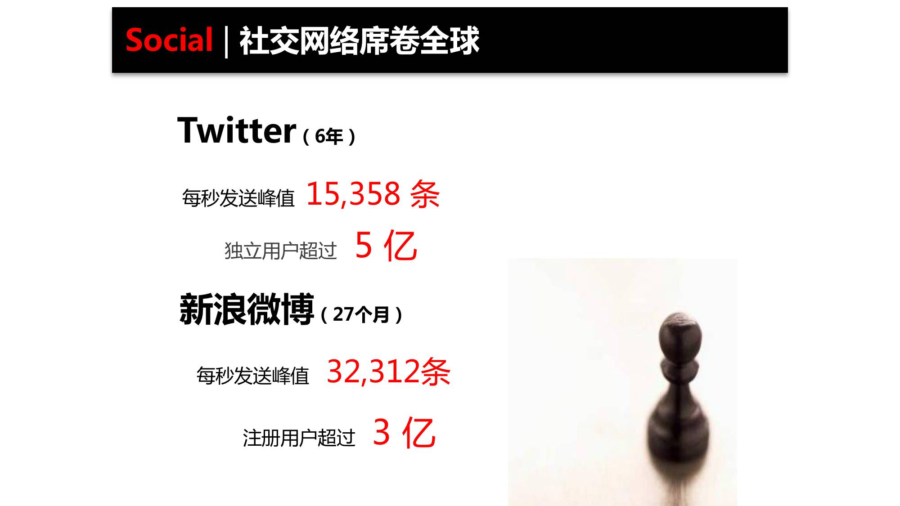

它的问题就是，页面文段之间的间距都相同了：

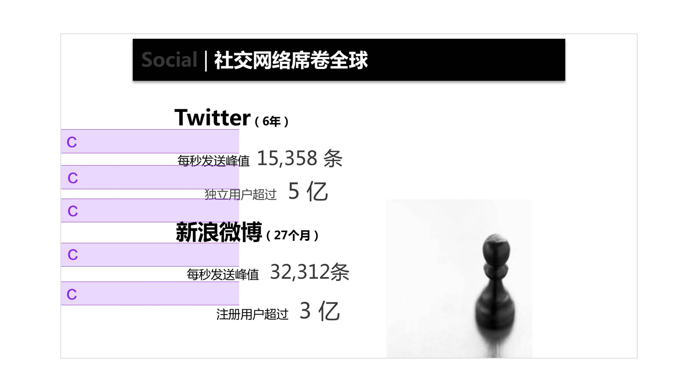

而这，带来的一个后果就是，内容之间缺少了层级关系。**因为标题和正文之间的，是要做出一定区分的。**

就像这样：

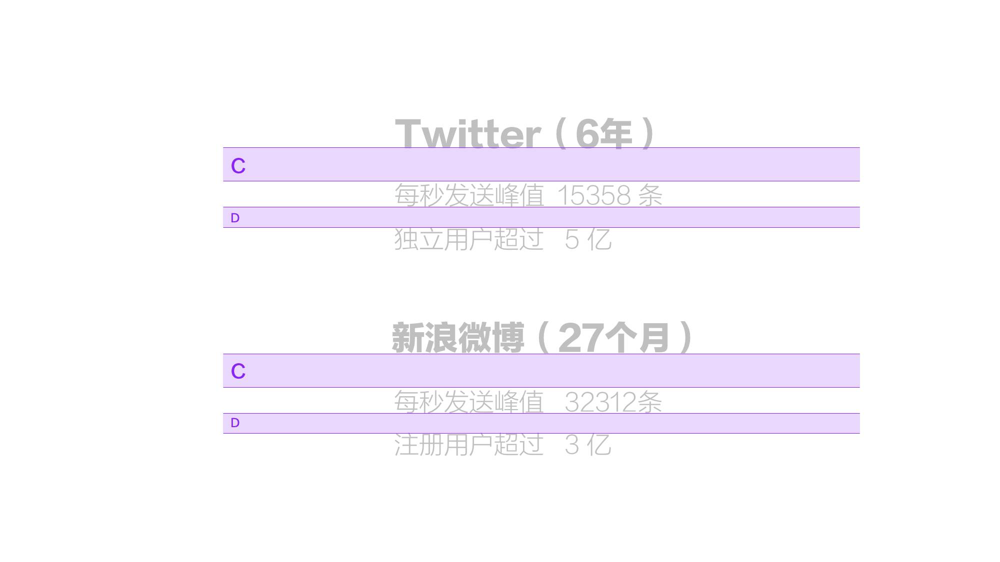

所以，如果对这一页进行优化，我们可以从这个方面入手，我同样也做了一个例子：

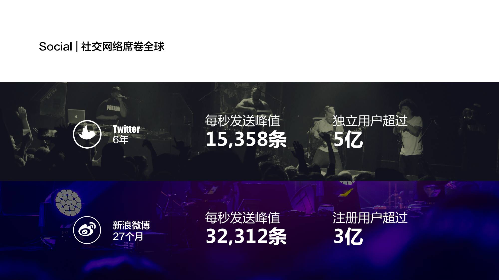

因此，要注意，排版时要注意间距的区分性。

 ——  **03  丝毫没规律的留白**  ——

想不起应该怎么对这种情况进行分类了，姑且叫做乱七八糟型吧。比如说下面这个例子：

大家可以看到，**页面内容的位置摆放很随意，我们也看不懂内容之间的逻辑到底是什么样的。**

那么，如果我们想要对它进行优化的话，就需要理解内容的逻辑后，再来确定它们的间距关系。在这里，我把内容进行了提取，发现它大概讲了两个部分：

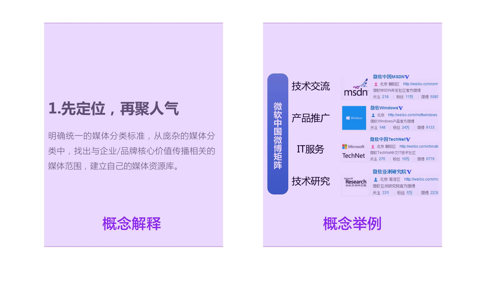

做完这一步之后呢，再对内容进行重新排版设计即可。大家可以看到，这时候，我们在阅读这张幻灯片的时候，是不是更加清晰了呢？

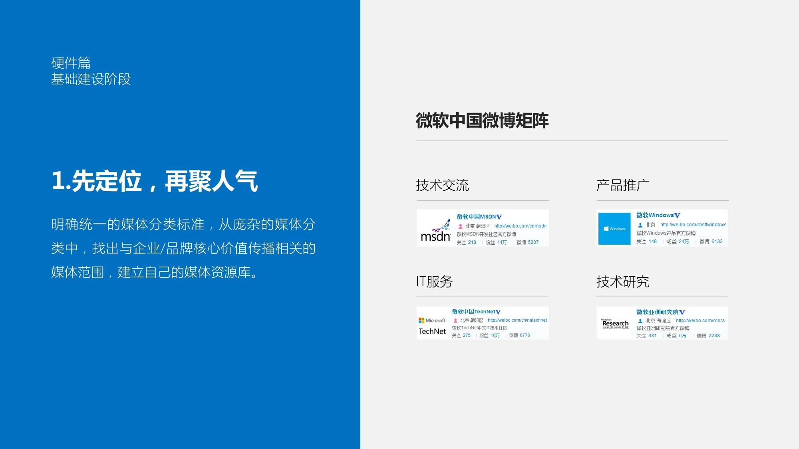

**明白了吗？在排版时，我们要根据内容的含义，来确定文段的位置，留白区域以及字号大小。**

好了，以上就是本文的全部内容，简单总结一下：

**留白的作用是区分不同含义的内容以及增强页面呼吸感，在排版时，要注意留白的运用。**

以上。
