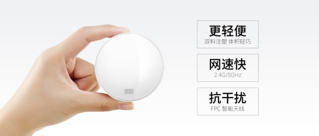
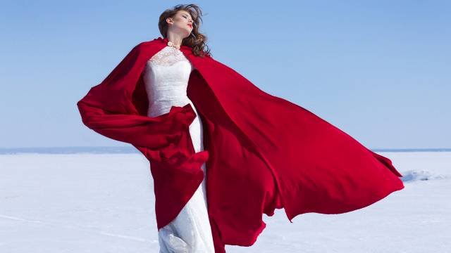
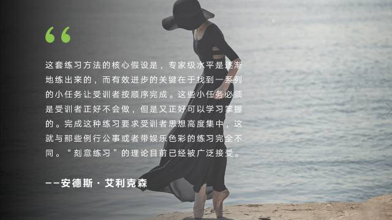
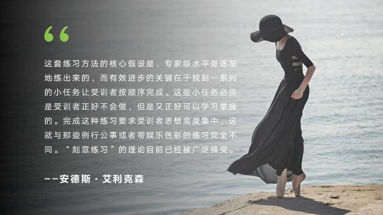
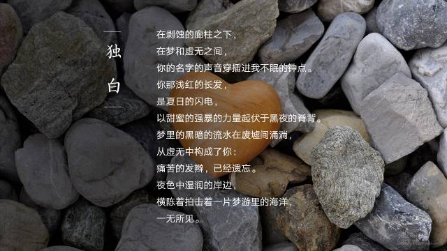
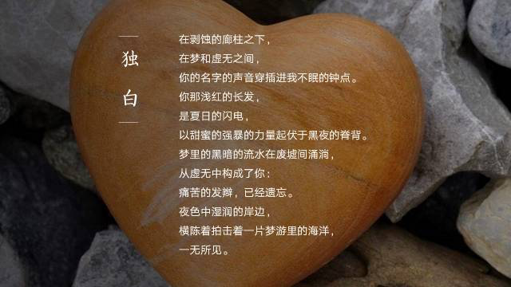
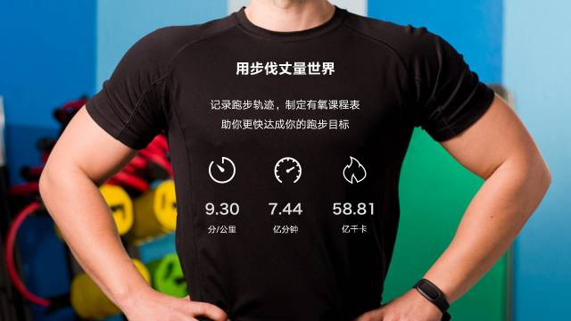
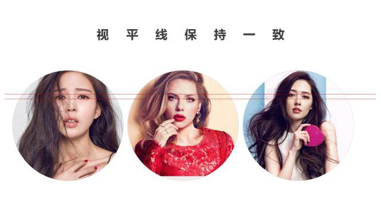

*2017-03-01* *邵云蛟* [旁门左道PPT](https://mp.weixin.qq.com/s?__biz=MzU2ODEyNzY3Mw==&mid=2247485976&idx=1&sn=7be36ef22f7849871d2d995ad949945d&scene=19##)

> 在 PPT 制作中，有两个必知的技能，一是怎么找到优质图片，我在之前的文章中提到过很多，也介绍了一些不错的网站，比如500PX等；
>
> **二是怎么用好图片，也就是当我们找到图片之后，该怎么对其进行处理。**这个方面我写的不多，在旁门左道的文章体系中，算是空白。所以，打算写一个关于图片处理的系列。这是第一篇，关于图片裁剪的应用。

提到裁剪，**可能很多读者，都知道怎么使用这个功能，即便不清楚，1分钟也能学会，无非就是选中图片，然后点击裁剪，即可「傻瓜式」地完成。**

当然，基本的操作你可能都了解，但你想过我们为什么要对图片进行裁剪吗？以及什么情况下，我们需要对图片进行裁剪？

**估计很多读者没有想过，而这，却正是用好图片裁剪功能的关键。**那么，我们为什么要裁剪图片呢？我认为有3个方面的考虑。

**1，考虑到 PPT 页面的构图平衡，需要利用裁剪来调整图片中主体物的位置**  

这句话是什么意思呢？我先来给各位解释两个概念。

一是**构图平衡。**指的就是页面中左右，或者上下等区域所占的视重大致相当。不理解也没关系，

给各位举个例子。

我们可以看到，**因为页面左边和右边各有一定的元素存在，维持了视觉平衡，所以，我们不会觉得这个页面空洞。这就是构图平衡。**

二是**图片中的主体物。**这个就更好理解了。同样地，咱们来看一张图。

**图片中的这位美女就是主体物，而其背后的天空等，我们可以理解为衬托物。**

好了，说到这里呢，想必各位对这两个概念有了一定理解。那为什么要先说这两个概念呢？跟裁剪有什么关系呢？

因为，很多时候，**我们在互联网上找到的图片中，可能大多数都是主体物居中，**这在摄影上，当然合理。

但是，**对于幻灯片制作而言，主体物居中则意味着，留给左右两边写文字的空间比较小，而我们又不能把字写在主体物脸上。**

所以，我们就需要通过裁剪，来调整主体物在图片中的位置。通常来说呢，**就是要裁剪掉图片一边的衬托物。才能够留出足够的写内容的区域，而且能够实现平衡构图。**

给各位举个例子。

比如，我们现在看到这样一张幻灯片。**因为主体物和内容都处在中间偏左的区域，所以，右侧看起来很空。也就是说，没有实现构图平衡。**

那么，该怎么处理呢？其实很简单。把图片右侧区域裁剪掉，然后，再将页面裁剪为16：9即可。我们再来看下效果。

当然，还有两个案例，供各位参考。几乎都需要对图片进行一定的裁剪。

**2，为了增强图片所表达的视觉效果，可以利用裁剪对主体物进行缩放**  

首先，先来说说，什么叫对主体物进行缩放呢？就是说，**通过对图片的衬托物区域的裁剪，留下更多主体物的区域。**这样，主体物就会在视觉上看起来发生了一定程度的放大。对不对？

给各位举个例子。比如我们看到这样的一张幻灯片。在一张遍布石头的图片上，写了一首关于爱情的现代诗。

但是，**如果我们想要更加突出显示中间那块黄色的心形石头的话，就需要对图片其他部分进行裁剪，为主体物留出更大面积。**

咱们裁剪后再来看下效果：

当然，利用这个方法，**我们不仅强调了主体物，而且，还腾出了一块可以专门用来写文字的区域。**对不对？

所以，利用这个思路，我们再来做一张幻灯片。假如说现在咱们要做一张跟健身跑步相关的 PPT ，配图找到了这一张：

**如果使用裁剪来调整图片主体物的位置，**我们可能会做出这样的幻灯片：

**而如果我们使用裁剪对进行主体物缩放，**我们可能做出这样的幻灯片：

这是使用裁剪的第二种思路。

**3，利用裁剪来让多张图片排版更加整齐**  

上面两点主要说的是单图的处理，其实，很多时候，我们还会遇到一些对于多张图片的处理问题。

那么，如果让多张图片看起来更加整齐呢？其实，**我们要做的，无非就是利用裁剪，使所有图片整齐划一罢了。那么，就需要用到裁剪，来让图片处理成一样的尺寸以及形状。**

我之前的整容计划[「整容计划」第9期](http://mp.weixin.qq.com/s?__biz=MzIwMDI0MTQxOQ==&mid=2650591326&idx=1&sn=8ffe034cabe9150bc099309214e34a09&scene=21#wechat_redirect)中，我做过这样的一个封面，利用的就是这个思路。

当然，需要展示多张人物照时，同样离不开裁剪，以便把照片能够整齐划一。这里就不单独举例。

**但是，有一点要注意。当去排版多张人物照时，一定要保持视平线一致，就是说眼睛在一条线上，否则，即便排版的再整齐，也会看起来很别扭。**

以上，就是关于图片裁剪功能的一些主要应用场景。当然，还有一些过于偏门的，百年难用一次，所以，就不一一说明。