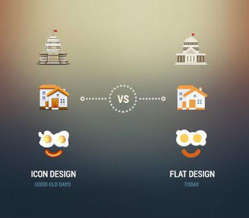
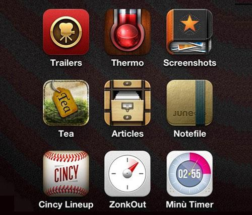
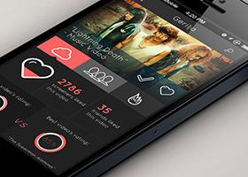
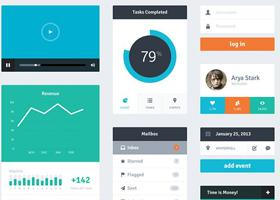
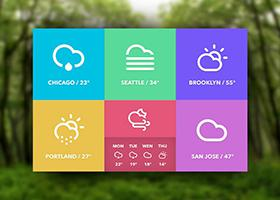

类别：行业新闻   时间： 2016-04-19 18:50

## **什么是扁平化**

摒弃高光、阴影等能造成透视感的效果，通过抽象、简化、符号化的设计元素来表现。界面上极简抽象、矩形色块、大字体、光滑、现代感十足，让你去意会这是个什么东西。其交互核心在于功能本身的使用，所以去掉了冗余的界面和交互。

## **扁平化设计的优点**

1. 简约而不简单，搭配一流的网格、色彩设计，让看久了拟物化的用户感觉焕然一新。
2. 突出内容主题，减弱各种渐变、阴影、高光等拟真视觉效果对用户视线的干扰，让用户更加专注于内容本身，简单易用。
3. 设计更容易，优秀扁平的设计只需保证良好的[网站](http://www.jaderd.com/)架构、网格和排版布局，色彩的运用和高度一致性。

## **扁平化设计的缺点**

需要一定的学习成本，且传达的感情不丰富，甚至过于冰冷。

那为什么[扁平化设计](http://www.jaderd.com/)能战胜拟物化设计呢？看看以下这张图你就明白了。

## **什么是拟物化**

模拟现实物品的造型和质感，通过叠加高光、纹理、材质、阴影等效果对实物进行再现，也可适当程度变形和夸张，界面模拟真实物体，拟物设计会让你第一眼就认出这是个什么东西。交互方式也模拟现实生活的交互方式。

## **拟物化计的优点**

1. 认知和学习成本低：外婆级的人也能看懂iOS里面几乎所有原生应用的图标。
2. 各种按钮的视觉质感和按下去之后的交互效果，养成用户对这类“东西”的统一认知和使用习惯。
3. 人性化的体贴：我相信有很多同学都非常喜欢ibooks的体验，用它来阅读确实是一种享受。

## **拟物化设计的缺点**

大多数拟物化界面并没有实现功能化，只是花费大量时间在视觉的阴影和质感效果。

为何扁平化能够逆袭拟物化呢，主要原因有以下三点：

**1.开发更加简单**

数码设备普及度不高的时代，拟物化是有效果的，尤其对于孩子和老人来说拟物化设计更直观有趣。但是随着数码科技的发展，拟物化的好处会越来越少，随之带来的是开发成本增加。

**2.使用更加高效**

拟物化是时代过渡中的一个不得已。在未来人眼中，一个温度计的app要特地设计成实体温度计的样子，一定傻透了。拟物≠高效，刻意拟物有时反而降低了效率。

**3.缓解审美疲劳**

论天下设计，繁久必简。拟物化设计的沉重感多少让人们开始审美疲劳，随着Windows 8的Metro界面发布，设计变得更简约清晰，势在必行。

