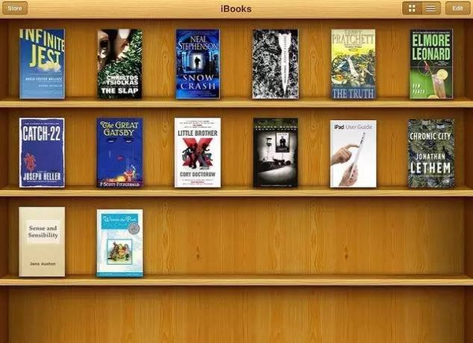
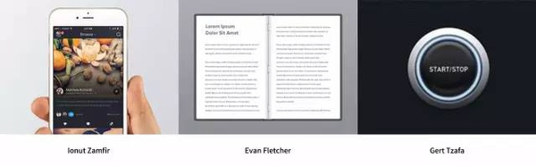
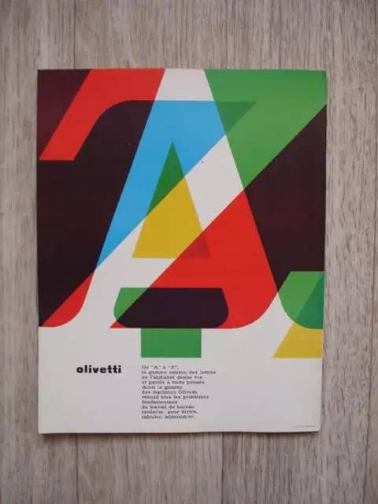
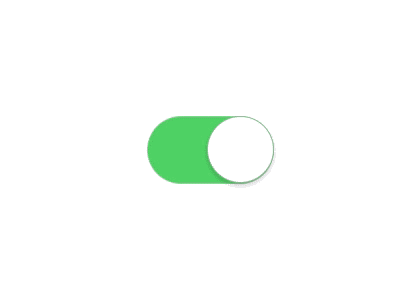
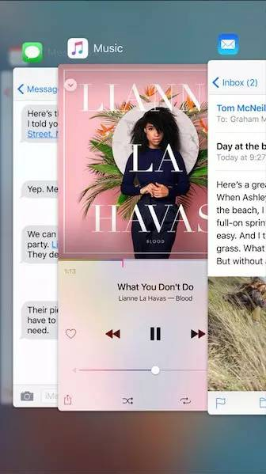
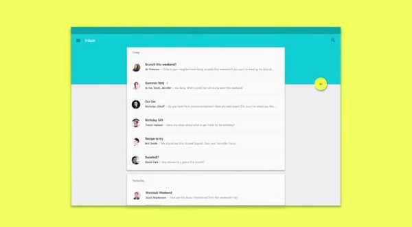
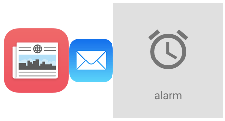

## 拟物化不死！在这个扁平化当道的年代，我还是爱着拟物化

编者按：「拟物化不是扁平化的对立面，而是作为扁平化的一部分永存。」今天[@特赞Tezign ](http://weibo.com/u/3704541797) 这篇译文，聊了聊拟物化和扁平化的关系，与平常看到的观点不同，文章认为拟物化并没有死亡，依然存在于扁平化之中。至于原因，一起来看看涨姿势。

「拟物化不是扁平化的对立面，而是作为扁平化的一部分永存。」

——村上春树 ，《挪威的森林》

好啦，不骗你了，其实原文是「死」和「生」。

当苹果公司于2013年推出iOS 7系统，许多人都说它宣判了拟物化设计的死刑。紧接着在2015年，当谷歌公司推出Material Design这个设计语言，许多人都认同这就是给拟物化设计的棺材上钉上了最后一根钉子。

不过，他们无疑是错的。

因为扁平化设计——正如在苹果的IOS和谷歌的Material Design系统中，数不胜数的热门网站和我们日常用的app中可以看到的那样——事实上并不是拟物化设计的对立面。

要想彻底明白为什么，我们首先需要理解什么是真正的拟物化设计。

#### **那么，什么是拟物化设计？** 

「拟物化设计」这个词源于希腊语中的「skeuos」（意为器具或工具）和「morphe」（意为形状）。在日常英语中，拟物化设计是对从一个对象到另一对象的视觉线索的应用。

关于拟物化设计最常被引用的例子是苹果公司 「旧有iOS 7系统” 的设计风格。例如，iBooks应用程序看起来像一个真实的书架——即有关一个书架的视觉线索（木质纹理、阴影和纵深感等等）被使用在了应用程序的用户界面里。

拟物化设计的重点是为用户提供即时语境：通过模仿公众熟知的日常物体的视觉线索，拟物化设计能降低用户去了解如何使用产品时需要的认知负荷。

理解这些，你就能知道实际上拟物化设计不仅仅是一个设计趋势。它还包括一个设计理念，即把现实生活中的对象用作视觉隐喻，使产品更便于使用。

#### **我们为什么要做拟物化设计？** 

随着iOS 7系统的发布，拟物化设计突然变的令人讨厌了。大部分人都会抱怨它是难看的。人造皮革拼接的视觉设计矫枉过正，别人也会附和。而这些言辞一般都是真的，许多人已经忘记了我们一开始为什么要做拟物化设计。

当苹果在2007的时候推出了iPhone，那时真的没有其他产品像它一样。通过在一块玻璃上进行触摸、点击以及捏动来控制一台设备，没有人对这些操作此感到熟悉。那么苹果如何向它的消费者展示产品的使用方式呢？——

通过使操作直观化的方式。所以你只需要看一遍，就能知道一款应用程序是关于什么的，以及如何使用它。

因此，在照片应用程序中的图像看起来像一堆真实的照片。电子书看起来像真实的书籍，结合现实物理学应用到翻页。按钮看起来像光滑的真实按钮，所以用户立马知道他们可以按下。

这是拟物化设计的魔法：用户界面在使用中变得顺理成章。

这就是为什么我们仍然需要（并使用）拟物化设计——因为没有它的设计会缺乏易于理解的情境。特别是面对复杂的任务时，这些设计变得很难操作。

#### **等等，那么扁平化设计呢？** 

大多数我们所熟知的扁平化设计（在iOS 7及之后，材料设计等等）的特点是扁平化的明亮大胆的颜色。它注重排版，同时也避免过于丰富的纹理。

扁平化设计最早出现在20世纪40年代瑞士风格的设计中，不过主要是因为响应在不同屏幕尺寸的设备上的设计需要，才在最近几年成为流行。

它的设计理念主要是围绕消除尽可能多的视觉噪声，为用户提供一个专注（和快速加载）的经验。

现在扁平化设计和拟物化设计的分歧变得越来越明显，但他们不是相互对立的哲学。拟物化设计是通过使用其他对象的视觉特征来使物象直观化；而扁平化设计是尽可能的减少视觉干扰。

的确，降低视觉噪声的一个可取的方式是在界面中去掉拟物化设计的纹理。但是再多看一眼你的扁平化风格的应用程序和操作系统，你会发现拟物化设计的精神内核仍然存在。

#### **在扁平化设计中拟物化** 

首先，让我们从拟物化被宣布死亡的iOS 7 +开始。

尽管iOS 7取消了大部分在以前版本中发现的人造结构，它仍然依赖拟物化去提高自己的可用性。有几个例子可以证明这一点。

ON/OFF开关根据扁平化设计的原则进行了重新设计，但基本的拟物化灵感（一个真实的旋钮）仍然被保留下来。从白色圆形旋钮下方浅浅的阴影可以看出一个真按钮的蛛丝马迹，所以你的大脑不会花太长的时间来辨认：这个圆圈是一个可操作的按钮。

阴影其实是拟物化平面设计的一个关键因素，因为它们告诉我们视觉元素的空间背景。这些，连同大量应用视差和模糊系统相互作用的影响，当面对iOS 7 +的视觉界面的时候，给人一种很真实的质感。

iOS 9的App切换界面清晰地显示了这些拟物化元素是如何集合起来让扁平化设计富有生命的。这里，App的视觉灵感来自卡片。这些卡片用浅浅的阴影来区分边界。模糊的背景也表示远处的卡片。它模仿了我们面对背景时视网膜在app上聚焦的状态。

所列出的这些体现在iO平面设计上的拟物化有可能是不太确定的，但是你已经掌握了大致的理念。

一个简单地例子，关于Google界面设计。

阴影大量使用在应用程序上，用来创造深度感和层次。事实上，谷歌对材料设计的解释是一种几乎完全拟物化的方法：

材质是隐喻……材料是在触觉的现实基础上，由纸张和墨水的研究的启发而来，尽管现在技术已经很先进了而且有开放的想象力和魔力。

有了基于现实生活中纸的视觉效果和动作设计，材料设计就能保证其视觉语言能直观地抓住用户眼球，甚至是第一次使用的用户。

拟物化设计可以在大多数操作系统中找到，尤其是在台式机（因为它能使复杂的界面直观），或是最受欢迎的网站（比如脸谱网和Pinterest的卡接口）。

但它也生长于一个看似无关的领域：影像学。

拟物化图标可能是平面设计和拟物化和谐共存的最鲜明的例子。我们每天使用的大多数图标都是来源于现实生活中的（通常是过时的）相似物。

以iOS中新闻应用程序图标为例，它参考了一堆报纸的意象。或是邮件应用程序的图标，它显示了一个纸信封的样子。或是在材料设计中的闹铃图标，来自一个双铃闹钟。

这些图标无疑是扁平的，但他们仍然是拟物的。

因此平面设计和拟物化设计不是相对的设计风格流派。我们需要把拟物化从设计理念到一个单一的、基于结构的尺寸简化出来，也是采用一个纯粹主义者对扁平化设计的理解。

我们不会因其复杂的直观界面而停止使用拟物化。但同时，扁平化设计可以使我们更加关注App、网页和操作系统设计的重点，让所有多余的视觉噪声消除。

所以别紧张。两种设计理念不是相互冲突的。相反，我们现在看到的那些迭代的界面设计是每种设计做的最好的产品。

作者 | Yu Siang Teo 翻译 | 李鑫然 校对 | 王沁雪