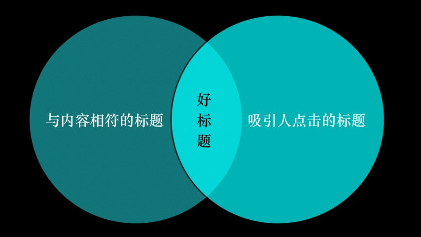
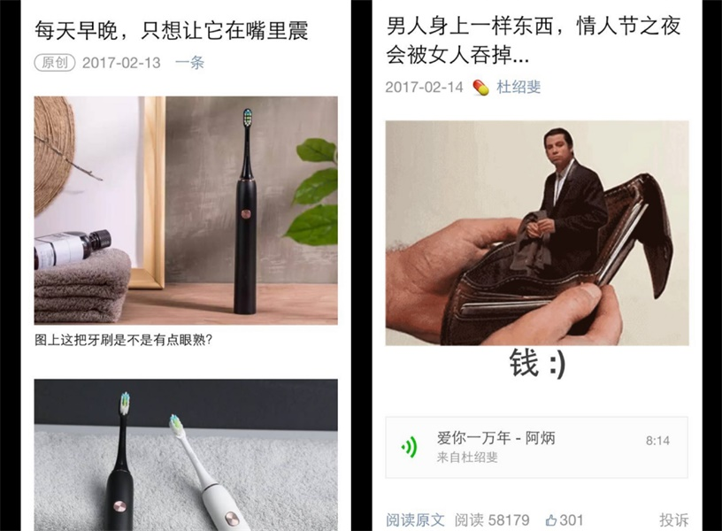
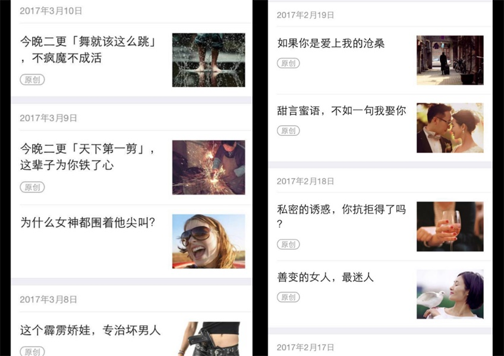
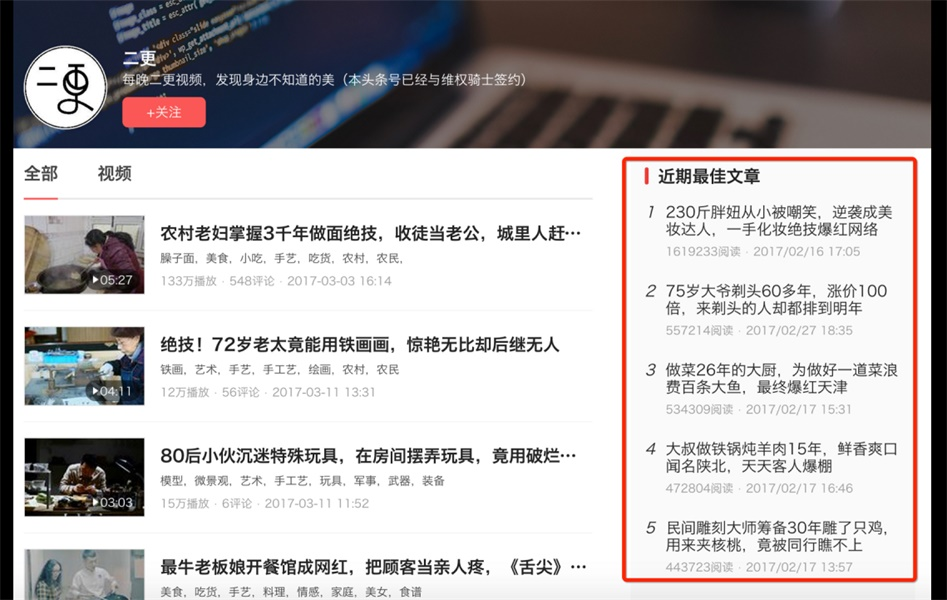

这是一个「信息微缩」的时代。

在报纸、杂志和电视盛行的那些年，消费者习惯拿出整块的时间，沉浸式地接收信息，但进入手机时代后，人们随时随地都可以获取海量内容，消费者的时间和注意力早已被撕扯成一块块碎片。

想要赢得他们的关注，文案就必须在这些细小的碎片中生长。一则亮眼的标题，在提升点击率进而提升转发率方面，扮演着日趋重要的角色。写标题的能力，已经成为衡量广告文案、新媒体运营者实力的重要指标。

#### 一、如何写出高点击率、转发率的标题？

想要写出一则叫好又叫座的标题，你首先需要明确，一个好标题和一个烂标题之间，有哪些区别？

坏标题有两种，一种平平淡淡，让人毫无点击欲；另一种是虚张声势，能吸引人点击，但标题下的内容却完全牛头不对马嘴，俗称「标题党」，「标题党」很危险，它会让用户觉得自己很蠢，被骗了，他们的好奇心会立刻转化愤怒的情绪，恨不得将写标题的人得而诛之。

一个好标题则是基于文章内容的巧妙提炼，它就像烤肉摊小哥往羊肉串上撒的那一撮孜然，能将路过的人吸引到面前来。

#### 二、写出一则好标题的12个技巧

置内容于不顾，割裂地谈论起标题的套路，是一种不负责任的行为。在这篇长文里，你将看到不同类型内容的标题技巧，以及不同自媒体平台（微信、今日头条等）的用户更喜欢什么样的标题。

接下来，我将内容分为情感/鸡汤、时尚/娱乐、生活/美食、科技/资讯、知识这五大垂直领域，分享这些内容写出好标题的技巧。

##### 1. 情感、鸡汤类内容

情感类内容的首要职责，就是帮助用户宣泄情绪，情感类标题的职责也同样在此。如果你研究过咪蒙、HUGO 等情感类大号的标题，你就会发现它们都在十分尽职地做着这件事情。

既然要宣泄情绪，标题通常需要观点鲜明，最好非黑即白。

**技巧一：用户本位**

来看看下面这些阅读量爆表的标题：

> 「孩子小，你不能让着点么？」「不能」（咪蒙）
>
> 「你是处女吗？」「关你屁事」（咪蒙）
>
> 「你有钱了不起啊？」「了不起」（咪蒙）
>
> 「女孩子不要太辛苦？」「你养我啊？」（HOGO）
>
> 「姨妈来了？多喝水」「滚！」（Papi酱）
>
> 职场女性：不敢嫁，不敢生（咪蒙）
>
> 有事直说，别问「在吗」（卡娃微卡）
>
> 别逼婚了，我觉得没人配得上我！（咪蒙）
>
> 我朋友圈发什么，管你屁事！（蛙哥漫画）

这些标题的相同点是字数较少，语法简单，很多直接采用了对话体。这类标题的诀窍在于，完全站在用户的角度，说他们的心里话，无需进行包装。优势在于，用户在一眼看到标题时，心中都会出现一些想@的人，胸中立刻腾起一股攻击欲，而这种心理对点击率尤其是转发率非常有利。

**技巧二：挑战常识+制造二元对立**

常识是「克己复礼」，反常识则是「纵容自己」，你说用户更愿意点击哪种标题？

来感受一下：

> 拜金虚荣换男友，但我不是坏女人（桃红梨白）
>
> 做一个不好相处的女人（HOGO）
>
> 谁规定女人一定要活成「贤良淑德」的模样？（灵魂有香气的女子）
>
> 会败家的女人更幸福（卡娃微卡）
>
> 正室要像小三一样活着（咪蒙）
>
> 倒霉的女孩，运气都不会太差（咪蒙）

上面几句标题，都打破了人们的常规认知，无论用户是否认同标题所体现出的观点，都很难抑制想要一探究竟的冲动。在标题写作上，需要刻意构建二元对立的因素，比如上述标题中的「坏女人」（好女人），「不好相处」（好相处），「会败家」（不会败家）、「正室」（小三），有的对立是隐性的，有的对立是显性的，无论如何，都需要在标题中塑造出这种对峙和矛盾。

**技巧三：悬念+利益点**

这类受欢迎的标题，往往以长者的口吻，知心善诱，为用户揭露生活的真相和幸福生活的窍门。

> 真正宠你的男人，会这样对你（入江之鲸）
>
> 约会中男生的哪些小动作，会让姑娘欲罢不能？（杜绍斐）
>
> 什么样的女人，最容易撩倒男人？（小北）
>
> 恋爱时，男人最烦女人这八种行为（故姐）
>
> 搞定男神的正确姿势（Papi酱）
>
> 男人会不会出轨，看这两点（女人多读书）
>
> 白羊座有哪些难以启齿的小怪癖？（同道大叔）
>
> 长相中等的姑娘如何进阶到「美」（蝉创意）

这类标题的常用技法，是在标题中往往利益点明确，让用户明白看完后能得到什么样的信息，同时制造悬念，吸引点击。比如「什么样的女人，最容易撩倒男人」这一则标题中，利益点就是「撩倒男人」，被隐藏起来的信息是「撩倒男人的诀窍」，如果没有明晰勾人的利益点，单纯地去谈制造悬念的技巧，无疑是一种徒劳。

##### 2. 时尚、娱乐类内容

娱乐、时尚类内容，是对平凡生活的一种抵抗。

平凡的对立面是什么？故事。

故事有起伏的情节，有悬念，能满足人的好奇和猎奇心理，而具有这些元素的标题，就很容易被用户的手指戳中。

**技巧一：人称代词+时间轴+反转**

这类标题多以第一人称代词「他/她」打头，并一气呵成地按时间顺序讲完这人一生的跌宕故事。这类标题基本上用户读了后就知道内容的梗概，但唯独不知道这人是谁。比如：

> 她是民国四大美女，17岁成影后，25岁在前夫和情人的冷漠下自杀，30万人为她送行（金融八卦女）
>
> 他是梁启超最爱，美国洗碗拿到博士，中国同学造导弹打中国，他造导弹保卫祖国（金融八卦女）
>
> 她是男神收割机，颜值高衣品更高，嫁给爱情后被宠成小公举，29岁依然活得像个18岁的小姑娘！（商务范）

以上，在内容符合事实的前提下，越狗血、越反转、越励志，越好。

**技巧二：悬念+信息阶梯**

在内容质量过关的前提下，能勾起用户好奇心和窥探欲的标题，都是好标题，比如：

> 揭秘一家融资4亿的游戏出海平台，马云、马化腾、史玉柱等大佬都在投资（娱乐资本论）
>
> 商家绝对不会告诉你的事实：我们用3个月测评了15款扫地机器人后发现……（清单）
>
> 和张蓝心被拍，尹正暴露真实身高了！忍不住以尹正为圆心研究了一圈男星身高（严肃八卦）
>
> 除了「来都来了」，还有一句魔咒，会令你狂买一堆垃圾（反裤衩阵地）
>
> 什么样的包，真正经得起时间考验（黎贝卡的异想世界）
>
> 跟风买这些口红，你只会越来越丑（YangFanJame）

这类标题都通过悬念成功制造出「信息阶梯」，即写作者掌握着阅读者不知道的秘密，转发这条信息的人掌握着只读了标题的人不知道的真相，从而提升标题的点击率和转发率。

##### 3. 生活、美食类内容

生活、美食类内容的标题，首要职责是如何用文字活灵活现地描绘出勾人的味觉、视觉、触觉、嗅觉，营造出感官上的吸引力。

**技巧一：满足多模式感知**

由于人类具有将视觉意象与言语讯息联系起来的文化倾向，也就是多模式感知的天性。心理学研究屡屡表明，字词所激发的概念，当它们能在头脑中产生清晰的视觉意象时，最容易被人记住。

> 神奇的牛轧糖葱香米饼，一口咬下54层（美食台）
>
> 怎样一口吃掉9朵玫瑰和15朵茉莉（美食台）
>
> 薄如蝉翼的金华火腿，每一口都是时间的味道（一条）
>
> 1.5斤新鲜甘蔗浓缩成一颗糖：它懂你不能说的（ENJOY美食）
>
> 集苹果、梨、枣三种风味于一身，这果子有点鲜（下厨房）

上面一组标题，都是在谈食物的风味，却都没有使用形容味道的形容词，而是用一些具象的名词来激发画面感，让人印象深刻。比如形容葱香米饼，不用「薄脆」，而用「一口咬下54层」；形容鲜花饼，不用「清香」，而用「吃掉玫瑰和茉莉」，让视觉和味觉产生联动。

**技巧二：寻找背书**

人们对于有来头的东西总是格外感兴趣，也更愿意一探究竟，这就是背书的力量。比如：

> 今年头采的西湖龙井，慈溪太后喝的就是这家的茶（一条）
>
> 这就是传说中得了2016红点奖的那个：猫厕所（一条）
>
> 故宫出了条开运红绳，姚晨、景甜、吴奇隆都在戴（一条）
>
> 从硅谷火到中国，每三秒就卖一个，用过这款榨汁机，你不想碰其他的（撕蛋）
>
> 我们找来了国内最有名的侍酒师，给你选了一瓶波特酒（企鹅吃喝指南）

上述标题中，历史故事、获奖经历、名人明星、销量、专业人士等都是让标题增加分量的方式。

**技巧三：形而上的提炼**

对很多人而言，吃什么、用什么的关键不仅在食物、器物本身，还在于它们能营造出的一种生活氛围，俗称「XX代表着XX的生活态度」。比如：

> 吃掉一只优秀的小龙虾，就抓住了南京的夏天（企鹅吃喝指南）
>
> 憋了一个冬天，老夫的少女心被这口小甜水唤醒了（企鹅吃喝指南）
>
> 只要锅子还在噗噜噗噜，心情就不会 blueblue（艾格吃饱了）
>
> 一颗懒蛋蛋，解救你的冬日焦虑症（ENJOY 美食）

现代人有太多病症需要治愈：失眠、焦虑、抑郁、丧、社交恐惧、尴尬癌……现代人有太多心理需要被满足：文艺心、玻璃心、逃离心、少女心、公主心、女王心……标题中出现了与此相关的字眼，点击率也会更有保障。

**技巧四：比较法**

比起天花乱坠的描述，比较法是省字又管用的一种技巧：

> 吃过这枚凤梨酥，其他的都是将就（艾格吃饱了）
>
> 它甜过世界上99%的水果，慕斯般口感好迷人（下厨房）
>
> 巧克力中的「爱马仕」，让自己站在今年情人节票圈的顶端（成都美食）
>
> 生理期用这10件小物，比红糖水管用100倍（IF）

在标题里通过比较，放大描述对象某一方面的特点，看上去似乎有点夸张却也不觉得浮夸，让用户更有进一步了解的欲望。

**技巧五：打擦边球**

这世界对白莲花很残酷。那些未经去污洗涤的标题往往是吸引眼球的利器。如：

> 他拍的1000张小弟弟的照片（蝉创意）
>
> 每天早晚，只想让它在嘴里震（一条）
>
> 我请你睡觉（一条）
>
> 男朋友那个很直是什么体验（蛙哥漫画）
>
> 男人身上一样东西，情人节之夜会被女人吞掉（杜绍斐）

以上，投机有风险，操作须谨慎。

##### 4. 科技、资讯类内容

这类内容中，有一些是新闻属性较强的，比如某大佬的新发言，某大厂的新动作等，这类内容的标题只要把相关关键词都怼上去，就已经足够吸引眼球。而这类内容以外，想要以标题给内容添彩，也有一些技巧。

**技巧：列数字**

这一类标题中往往含有一组或多组数字，由于数字是模糊的对立面，所以容易给人一种专业感和权威感，比如：

> 追踪了783家创业公司五个月，分析了64.7万条数据，我们发现了10个有趣的现象（虎嗅网）
>
> 新闻业务衰落以后，这11张图告诉你三个老门户如今都靠什么谋生（好奇心日报）
>
> YY 的海外故事：1年3000万月活、估值4亿美金的直播平台，能有怎样的想象（36Kr）
>
> 逃离小程序：60%用户回归 APP，70%开发者欲放弃开发（钛媒体）

##### 5. 知识类内容

知识类内容必须要有信息增量，才是有价值的，而此类内容的标题中，就必须明确地体现这一点。

**技巧：化繁为简**

> 一篇文章为何能引爆朋友圈？用户主动转发背后的8个内容传播规律（馒头商学院）
>
> 一篇长文，读懂「10万+」标题的全部套路（乌玛小曼）
>
> 10分钟了解在线广告的逻辑和常见模式（三节课）
>
> 拜访拥有5亿粉丝的21位自媒体大佬后，我得出22条结论（新榜）
>
> 这4个灵魂问题，解决你80%的困境（LinkedIn）

看到上面这组标题，你是不是还没看内容，就快要抑制不住想收藏和转发的心情了？它们的共同特点在于将内容包含的知识进行了非常简化的提炼，让用户一眼看上去心理负担很小，诸如「8个规律」、「一篇长文」、「10分钟」、「22条结论」、「4个问题」都用数字体现了非常清晰的利益点。

#### 三、掌握了起标题的技巧，你还需要知道什么？

除了上述的微观技巧，了解一些宏观的趋势，对于写出一则好标题也很有帮助。

**1. 标题正变得越来越长**

在纸媒时代，好标题有一个重要的要素：短。因为纸质印刷物的成本高，版面有限。到了数字化时代，标题则不用再担心这一约束。现在，微信订阅号允许的标题长度为64个字，头条号允许的标题长度为30个字。

新榜通过对2000余篇10万+爆文的分析，亦发现微信爆款文章的标题字数呈现增长趋势：

> 2015年2月16日，平均标题长度为18.02个字；
>
> 2016年2月16日，平均标题长度为19.29个字；
>
> 2017年2月16日，平均标题长度为21.66个字。

新媒体专家刘晨认为，新媒体环境下信息越写越长，是一种「信息前置」现象，根本原因是信息爆炸导致注意力资源愈发稀缺，「与其把信息都折叠进内文里被动等待用户打开，不如直接把信息展示在入口上让人一看便知」。

这就要求内容创作者需要从用户的角度去考虑标题，在对内容一无所知的前提下，思考什么样的标题最让人有点击的欲望。

**2. 不同的自媒体平台，欢迎不同的标题**

多平台分发已经成为内容创作的必然趋势。那么，同样一个标题，发布到微信公众号、头条号等大流量平台上，会起到同样的效果吗？我们不妨来对比一下「二更」在微信公众号和头条号上的标题。

上图是「二更」在微信公众号里的标题，反映出来的特点是：字数较少，意义抽象，乍一看标题难以知晓具体内容。再来看看「二更」在头条号的标题：

从上图右侧「最佳文章」列表中，可以看出「二更」在头条号上阅读量动辄几十万上百万的文章标题，字数较多，并且意义具体，基本上用户看了标题就知道内容在讲什么了。

「二更」为什么要在不同的自媒体平台，使用不同的标题呢？因为它明白微信公众号和头条号的分发机制是不同的。微信是一个社交平台，分发基于社交关系，所以那些带有社交话题属性的内容和标题（比如男女情感、星座等），更容易受到欢迎。

而今日头条是一个资讯平台，采用机器算法分发机制，一些意义具体的词汇，更容易被机器识别，然后将它们推送给喜欢阅读这些「标签」的用户，而用户也更喜欢点击具有故事感的标题。

#### 结语

如果你希望你的内容在不同平台都能收获不错的流量，除了掌握写一则爆款标题的常见技巧，更需要多多琢磨在各大平台上流量较好的账号们都在如何起标题，相信你会有更多的收获。